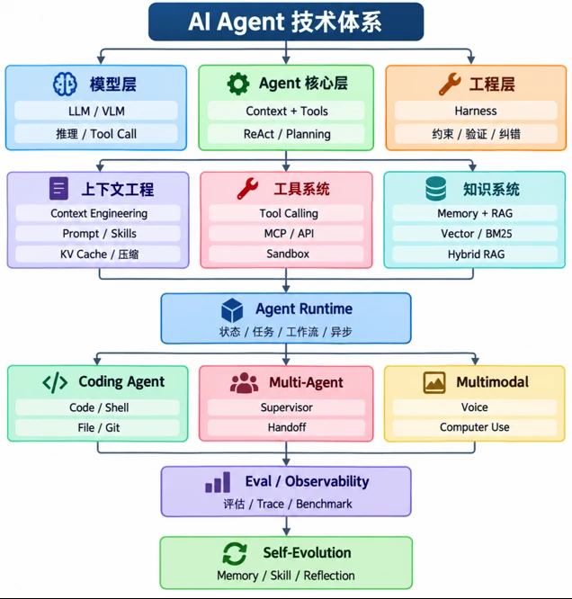

# AI Agent 学习路线

Agent 不只是一次模型调用。一个能稳定完成任务的 Agent，需要模型能力、上下文工程、工具与知识系统、运行时、评估体系和后端工程共同配合。

{ loading=lazy }

## 01 / 模型与 Agent 核心

先建立最小闭环：**用户目标 → 模型判断 → 工具调用 → 结果反馈 → 最终回答**。

- **模型层**：LLM / VLM、推理、结构化输出与 Tool Calling。
- **Agent 核心层**：Context + Tools、ReAct、Planning。
- **工程层**：Harness、约束、验证、纠错与失败恢复。

阶段项目：做一个只有 1–3 个工具的任务助手，并为每个工具补充参数校验、超时和可读错误信息。

## 02 / 上下文、工具与知识

| 系统 | 重点 | 常见问题 |
| --- | --- | --- |
| 上下文工程 | Prompt、Skills、压缩、KV Cache | 信息过载、关键约束丢失 |
| 工具系统 | Tool Calling、MCP、API、Sandbox | 权限过宽、参数错误、执行失败 |
| 知识系统 | Memory、RAG、Vector、BM25、Hybrid RAG | 召回不准、知识过期、引用缺失 |

阶段项目：给助手接入一个真实 API 和一个小型知识库，保留检索证据，并测试“找不到答案”的行为。

## 03 / Agent Runtime

Runtime 管理状态、任务、工作流与异步执行。将一次复杂任务拆成明确步骤，并让每一步都能被记录、重试或取消。

建议先实现单 Agent 工作流，再选择一个方向扩展：

- **Coding Agent**：Code / Shell、File / Git。
- **Multi-Agent**：Supervisor、任务分派与 Handoff。
- **Multimodal**：Voice、Computer Use 与图像理解。

## 04 / Eval、Observability 与自进化

没有评估，就无法判断 Agent 是否真的变好。为典型任务建立小型数据集，记录成功率、延迟、Token、工具错误和人工评分，并通过 Trace 定位失败步骤。

自进化应建立在评估结果上：沉淀有效 Memory、复用 Skill、记录 Reflection，同时为自动修改设置边界和回归验证。

## 推荐实践顺序

1. 单轮模型调用与结构化输出。
2. 单工具调用与参数验证。
3. ReAct 或显式工作流。
4. RAG、Memory 与引用。
5. 异步任务和持久化状态。
6. Trace、评估集和回归测试。
7. Coding Agent、Multi-Agent 或多模态专项。

!!! note "后端能力是 Agent 的底座"
    鉴权、数据库、缓存、队列、文件存储、日志和部署决定了 Agent 能否从 Demo 走向稳定应用。建议与[后端学习路线](../Backend/index.md)并行推进。

[查看完整双主线规划 :material-arrow-right:](../learning-paths.md){ .md-button .md-button--primary }

