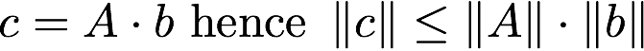

# 线性代数

## 标量与向量
- **标量（Scalar）**：一个单一的数值，表示大小或数量。例如，温度、质量等都是标量。
- **向量（Vector）**：一个有方向和大小的量，通常表示为一个有序的数值列表。例如，速度、力等都是向量。

## 矩阵与张量
- **矩阵（Matrix）**：一个二维数组，由行和列组成，用于表示线性变换或数据集。例如，图像可以表示为一个矩阵，其中每个元素表示像素值。
- **张量（Tensor）**：一个多维数组，是矩阵的推广。

## 张量算法的基本性质
- **加法与减法**：张量可以进行加法和减法运算，但必须满足维度相同。
- **标量乘法**：张量可以与标量相乘，结果是每个元素都乘以该标量。
- **点积与叉积**：向量之间可以进行点积和叉积运算，点积用于测量两个向量的相似性，叉积用于计算两个向量的垂直向量。
- **矩阵乘法**：矩阵之间可以进行乘法运算，但必须满足矩阵的维度匹配条件。
- **转置**：矩阵的转置是将其行和列互换。
- **逆矩阵**：对于一个方阵，如果存在一个矩阵，使得它与原矩阵相乘得到单位矩阵，则该矩阵称为原矩阵的逆矩阵。
- **秩（Rank）**：矩阵的秩表示其行或列的线性独立性，反映了矩阵的信息量。

## 范数

### 常见范数
- **L1范数（曼哈顿距离）**：向量各元素绝对值之和，表示为 ||x||₁ = Σ|xi|。
- **L2范数（欧几里得距离）**：向量各元素平方和的平方根，表示为 ||x||₂ = √(Σxi²)。
- **无穷范数（最大范数）**：向量中绝对值最大的元素，表示为 ||x||∞ = max|xi|。

