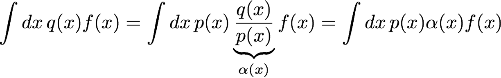
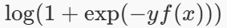
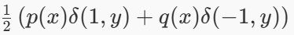

# 10. 泛化表现，协变量偏移 和 对抗性数据

> 内容概要:
> 
> - 泛化表现
>       - 协变量偏移（Covariate Shift）
>       - 标签偏移（Label Shift）
>       - 协变量偏移校正（Covariate Shift Correction）
> - 对抗性数据
> - 非平稳环境

## 训练 VS 测试
在训练阶段，我们使用训练数据集来训练模型，并通过验证数据集来调整模型的超参数，以提高模型的性能。最终，我们使用测试数据集来评估模型的泛化能力，即模型在未见过的数据上的表现。
## 泛化表现
泛化表现是指模型在未见过的数据上的表现能力。一个好的模型应该能够在训练数据之外的测试数据上表现良好，这就是我们所说的泛化能力。
### 为什么出现泛化表现？
数据分布 p(x, y)
从 p(x, y) 绘制的数据集
训练可以最大限度地降低经验风险（加上正规化）
$\hat{R}(\theta) = \frac{1}{m} \sum_{i=1}^{m} L(x^{(i)}, y^{(i)}, \theta) + \Omega(\theta)$

在测试时，预期风险很重要（根据所有已观测的其他数据）
$R(\theta) = \int L(x, y, \theta) p(x, y) dx dy$

### 如何修复
- 输入噪声（稍后）
- 丢弃法（层内噪声）
- 平滑函数 f（例如 权重衰减）

### 协变量偏移（Covariate Shift）
协变量偏移是指训练数据和测试数据的输入分布不同，但输出分布相同的情况。这种情况可能会导致模型在测试数据上的表现不佳，因为模型在训练阶段没有见过测试数据的输入分布。
### 标签偏移（Label Shift）
标签偏移是指训练数据和测试数据的输出分布不同，但输入分布相同的情况。这种情况也可能会导致模型在测试数据上的表现不佳，因为模型在训练阶段没有见过测试数据的输出分布。
$q(y) = \int p(y|x) p(x) dx$
### 协变量偏移校正（Covariate Shift Correction）
协变量偏移校正是指通过某些方法来调整模型，使其能够适应测试数据的输入分布，从而提高模型在测试数据上的表现能力。
$\hat{R}(\theta) = \frac{1}{m} \sum_{i=1}^{m} \frac{p_{test}(x^{(i)})}{p_{train}(x^{(i)})} L(x^{(i)}, y^{(i)}, \theta) + \Omega(\theta)$

## 对抗性数据
对抗性数据是指通过对输入数据进行微小的扰动，使得模型在测试数据上的表现不佳。这种情况可能会导致模型在测试数据上的表现不稳定，因为模型在训练阶段没有见过这种类型的数据。
## 非平稳环境（Non-Stationary Environment）

非平稳环境是指数据分布在时间上发生变化的情况。这种情况可能会导致模型在测试数据上的表现不佳，因为模型在训练阶段没有见过这种类型的数据。在非平稳环境中，模型需要能够适应数据分布的变化，以保持良好的泛化能力。

> 小结：
> 
> - 泛化表现（经验分布）
> - 协变量偏移（输入分布）
> - 逻辑回归（条件分布）（修复偏移的工具）
> - 标签偏移（输出分布）
> - 协变量偏移校正（输入分布校正）
> - 对抗性数据（输入扰动）\(x+\epsilon\)（其中 $ϵ$ 是一个小的扰动）
> - 非平稳环境（时间变化）\(p(x,y,t)\)（其中 $t$ 是时间）
