# 12. 卷积神经网络

> 内容概要：
>
> - 卷积
>       - 平移不变性和局部性 
>       - 卷积层
>       - 填充和步幅
> - 多个输入和输出通道

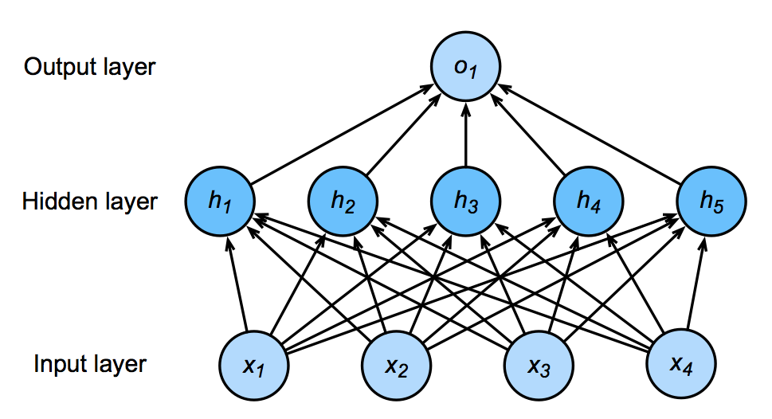

单隐含层网络($y=σ(Wx+b)$)

## 12.1卷积
卷积是一种数学运算，用于在信号处理和图像处理中提取特征。在卷积神经网络中，卷积操作用于提取输入数据中的局部特征，从而提高模型的性能。

将输入和输出变形为矩阵（宽度，高度）,将权重变形为4-D张量（h, w）到（h’, w’）
$h_{i,j}=∑_{k,l}w_i,j,k,lx_k,l=∑_{a,b}v_i,j,a,bx_i+a,j+b$

V是W的重索引

$v_{i,j,a,b}=w_{i,j,i+a,j+b}$

### 12.1.1平移不变性和局部性
平移不变性是指模型对于输入数据的平移操作具有不变性，即模型对于输入数据的平移操作不会影响模型的输出。局部性是指模型对于输入数据的局部特征具有敏感性，即模型能够捕捉输入数据中的局部特征。

#1 

$h_{i,j}=∑_{a,b}v_{i,j,a,b}x_{i+a,j+b}$

x 的变化也导致 h 的变化,V 不应该依赖于（i，j），所以$v_i,j,a,b=v_a,b$

$h_i,j=∑_{a,b}v_a,bx_{i+a,j+b}$

#2 

$h_i,j=∑_{a,b}v_{a,b}x_{i+a,j+b}$

当评估 h(i,j) 时，我们不应该用远离 x(i, j) 的参数,外部参数 |a|,|b|>Δ 消失，v_{a,b}=0

$h_{i,j}=∑_{a=-Δ}^{Δ}∑_{b=-Δ}^{Δ}v_{a,b}x_{i+a,j+b}$

### 12.1.2卷积层
卷积层是卷积神经网络中的一个重要组成部分，它通过卷积操作提取输入数据中的局部特征。卷积层由多个卷积核组成，每个卷积核用于提取输入数据中的不同特征。

#### 12.1.2.1二维交互相关

计算过程：

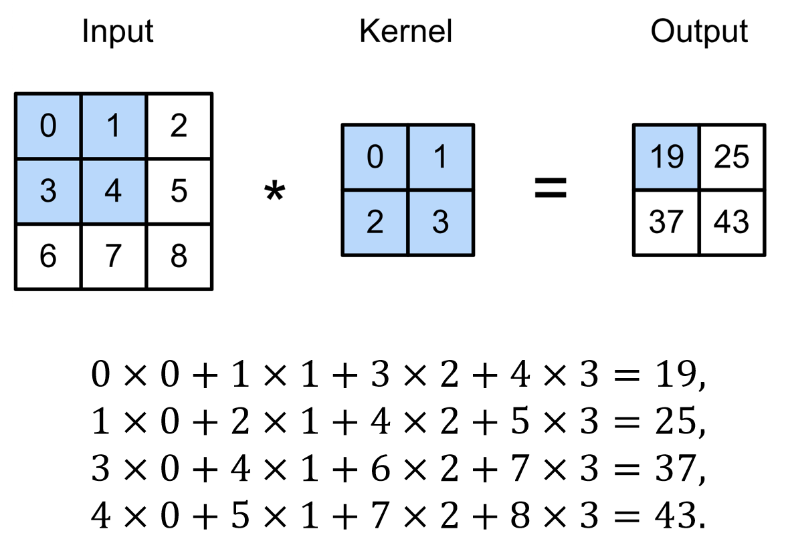

示意图：

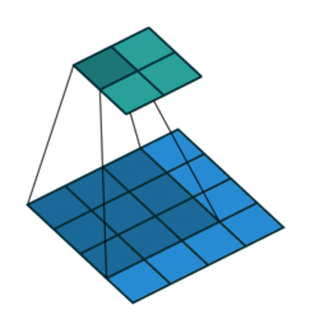

- X:$n_h×n_w$ 输入矩阵
- W:$k_h×k_w$核矩阵
- b:偏差标量
- Y:$n_h-k_h+1$×$n_w-k_w+1$ 输出矩阵
                                   
W 和 b 是可学习的参数

**e.g.** 用于边缘检测、模糊、锐化等图像处理任务

#### 12.1.2.2互相关与卷积
互相关是卷积操作的一种特殊情况，它不考虑卷积核的翻转。在卷积神经网络中，互相关操作通常用于提取特征。卷积操作则考虑卷积核的翻转，通常用于信号处理和图像处理中。

** 二维互相关 **
$y_{i,j}=∑_{a=1}^{h}∑_{b=1}^{w}w_{a,b}x_{i+a,j+b}$

** 二维卷积 **
$y_{i,j}=∑_{a=1}^{h}∑_{b=1}^{w}w_{-a,-b}x_{i-a,j-b}$

** 一维卷积 **
$y_i=∑_{a=1}^{h}w_{a}x_{i+a}$

** 三维卷积 **
$y_{i,j,k}=∑_{a=1}^{h}∑_{b=1}^{w}∑_{c=1}^{d}w_{a,b,c}x_{i+a,j+b,k+c}$

### 12.1.3填充和步幅
填充是指在输入数据的边缘添加额外的像素，以保持卷积操作后输出数据的尺寸不变。步幅是指卷积核在输入数据上移动的步长，较大的步幅可以减少输出数据的尺寸，从而降低模型的计算复杂度。

### 12.1.3.1填充

给定输入图像（32 x 32），应用5 x 5大小的 卷积核，第1层得到输出大小28 x 2，第7层得到输出大小4 x 4 ，更大的卷积核可以更快地减小输出 ，形状从$n_h×n_w$减少到$(n_h-k_h+1)$×$(n_w-k_w+1)$

<u>填充： 在输入周围添加额外的行 / 列</u>

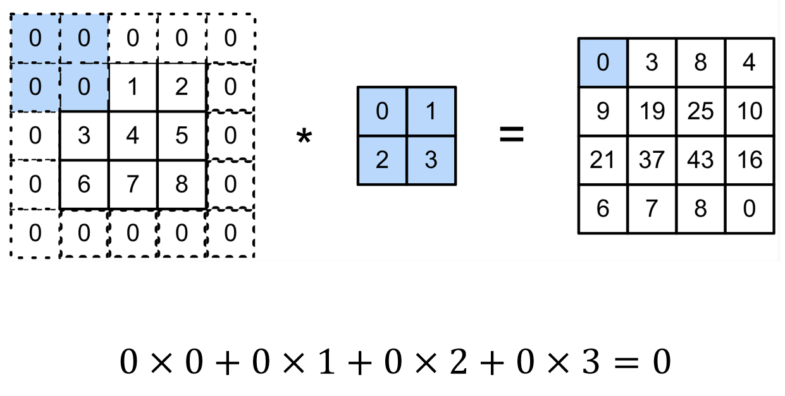

示意图:

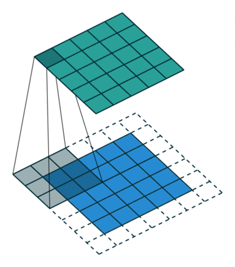

填充 $p_h$ 行和 $p_w$ 列，则输出为：$(n_h-k_h+p_h+1)$×$(n_w-k_w+p_w+1)$

通常取$p_h=k_h-1,p_w=k_w-1$

- 当$k_h$为奇数 : 在上下两侧填充 $p_h/2$ 
- 当 $k_h$ 为偶数 : 在上侧填充 ⌈$p_h/2$⌉,在下侧填充 ⌊$p_h/2$⌋


### 12.1.3.2步幅

填充降低的输出大小与层数线性相关,给定输入大小224*224，在使用5*5卷积核的情况下，需要44层将输出降低到4*4,需要大量的计算

<u>步幅是指行/列的滑动步长</u>

e.g.高度3 宽度2 的步幅

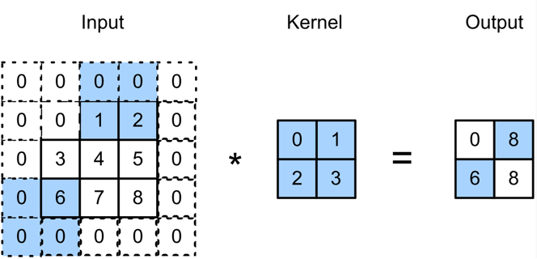

0×0+0×1+1×2+2×3=8

0×0+6×1+0×2+0×3=6

示意图：

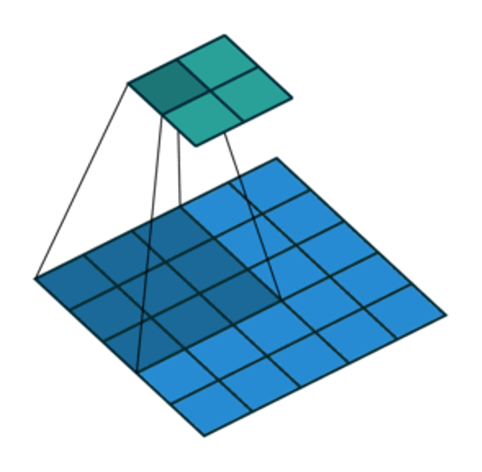

1.给出高度 $s_h$ 和宽度 $s_w$ 的步幅，输出形状是 $\left\lfloor\frac{n_h-k_h+p_h+s_n}{s_h}\right\rfloor×\left\lfloor\frac{n_w-k_w+p_w+s_w}{s_w}\right\rfloor$

2.如果 $p_h=k_h-1$， $p_w=k_w-1$，则输出形状为 $\left\lfloor\frac{n_h+s_h-1}{s_h}\right\rfloor×\left\lfloor\frac{n_w+s_w-1}{s_w}\right\rfloor$

3.如果输入高度和宽度可以被步幅整除，则输出形状为 ($n_h/s_h$)×($n_w/s_w$)

## 12.2多个输入和输出通道

彩色图像可能有 RGB 三个通道，转换为灰度会丢失信息。

每个通道都有一个卷积核，结果是所 有通道卷积结果的和。

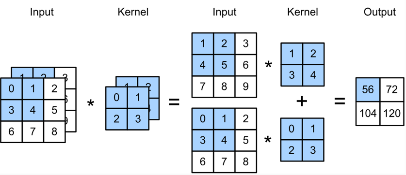

### 12.2.1多个输入通道

$X:c_i$×$n_h$×$n_w$输入

$W:c_i$×$k_h$×$k_w$卷积核

$Y:m_h$×$m_w$输出

**$Y = \sum_{i=1}^{c_i}W_i*X_i$**

=== "Python"
```python
import torch
from d2l import torch as d2l
def corr2d_multi_in(X, K):
    return sum(d2l.corr2d(x, k) for x, k in zip(X, K))
X = torch.tensor([[[0.0, 1.0, 2.0], [3.0, 4.0, 5.0], [6.0, 7.0, 8.0]],
               [[1.0, 2.0, 3.0], [4.0, 5.0, 6.0], [7.0, 8.0, 9.0]]])
K = torch.tensor([[[0.0, 1.0], [2.0, 3.0]], [[1.0, 2.0], [3.0, 4.0]]])

corr2d_multi_in(X, K)
```
输出
```math
tensor([[ 56.,  72.],
        [104., 120.]])
```

### 12.2.2多个输出通道

无论有多少输入通道，到目前为止我们只用到单输出通道，可以有多个3-D卷积核，每个核生成一个输出通道。

$X:c_i$×$n_h$×$n_w$输入

$W:c_o$×$c_i$×$k_h$×$k_w$卷积核

$Y:c_o$×$m_h$×$m_w$输出

**$Y = \sum_{i=1}^{c_o}W_i*X$**

每个输出通道可以识别特定模式，输入通道内核识别并组合输入中的模式。

=== "Python"
```python
def corr2d_multi_in_out(X, K):
    return torch.stack([corr2d_multi_in(X, k) for k in K], 0)
K = torch.stack((K, K + 1, K + 2), 0)"""通过将核张量K与K+1（K中每个元素加 1）和K+2连接起来，构造了一个具有 3个输出通道的卷积核。"""
K.shape
```
输出
```math 
torch.Size([3, 2, 2, 2])
```
```python
corr2d_multi_in_out(X, K)
```
输出
```math
tensor([[[ 56.,  72.],
         [104., 120.]],

        [[ 76., 100.],
         [148., 172.]],

        [[ 96., 128.],
         [192., 224.]]])
```

## 12.3 1×1卷积层

$k_h=k_w=1$，它不识别空间模式，只是融合通道。

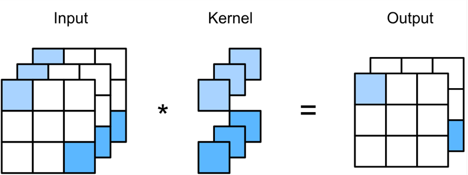

相当于具有输入 $n_hn_w$×$c_i$ 和重量 $c_o$×$c_i$ 的全连接层。

```python
def corr2d_multi_in_out_1x1(X, K):
    c_i, h, w = X.shape
    c_o = K.shape[0]
    X = X.reshape((c_i, h * w))
    K = K.reshape((c_o, c_i))
    Y = torch.matmul(K, X)
    return Y.reshape((c_o, h, w))
    X = torch.normal(0, 1, (3, 3, 3))
    K = torch.normal(0, 1, (2, 3, 1, 1))
    Y1 = corr2d_multi_in_out_1x1(X, K)
    Y2 = corr2d_multi_in_out(X, K)
    assert float(torch.abs(Y1 - Y2).sum()) < 1e-6
```

## 12.4 2-D卷积

$Y_{i,j} = \sum_{a=1}^{k_h}\sum_{b=1}^{k_w} W_{i,a,b} X_{i+a,j+b} + B_i$

## 12.5 汇聚层

核心目的是**对卷积提取的特征图进行降维**。

### 12.5.1 最大汇聚和平均汇聚

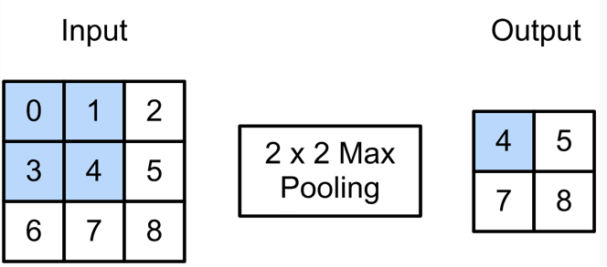

$(max(0,1,3,4)=4)$ 


- 最大汇聚层：每个窗口中最强的模式信号
- 平均汇聚层：将最大汇聚层中的“最大”操作替换为“平均” ，窗口中的平均信号强度

=== "Python"
```python
import torch
from torch import nn
from d2l import torch as d2l
def pool2d(X, pool_size, mode='max'):
    p_h, p_w = pool_size
    Y = torch.zeros((X.shape[0] - p_h + 1, X.shape[1] - p_w + 1))
    for i in range(Y.shape[0]):
        for j in range(Y.shape[1]):
            if mode == 'max':
                Y[i, j] = X[i: i + p_h, j: j + p_w].max()
            elif mode == 'avg':
                Y[i, j] = X[i: i + p_h, j: j + p_w].mean()
    return Y
X = torch.tensor([[0.0, 1.0, 2.0], [3.0, 4.0, 5.0], [6.0, 7.0, 8.0]])
pool2d(X, (2, 2)) # 验证二维最大汇聚层的输出
pool2d(X, (2, 2), 'avg') # 验证二维平均汇聚层的输出
```
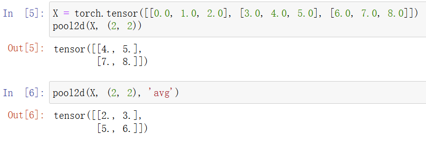

## 12.6 汇聚层的填充，步幅和多个通道

- 汇聚层与卷积层类似，都具有填充和步幅 
- 没有可学习的参数
- 在每个输入通道应用汇聚层以获得相应的输出通道
- 输出通道数 = 输入通道数（汇聚层不会改变特征图的通道数量，只会在每个通道内部对空间维度进行降采样）
  
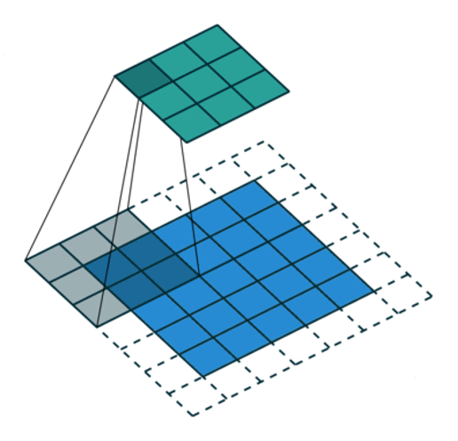

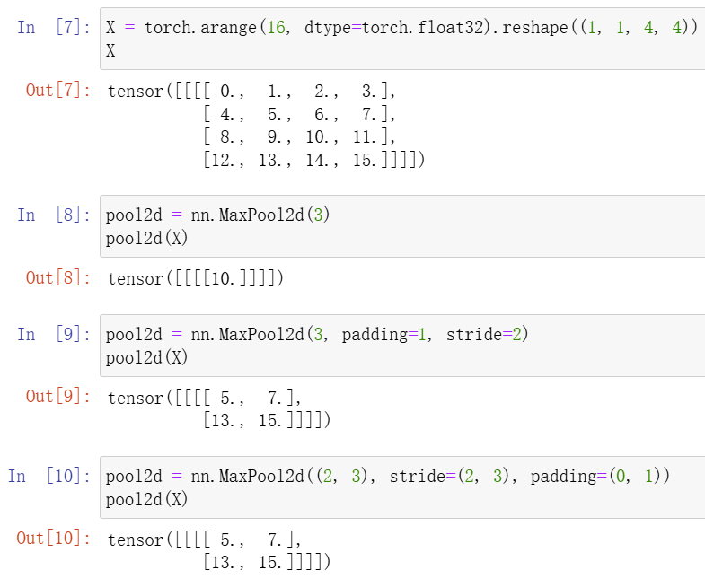

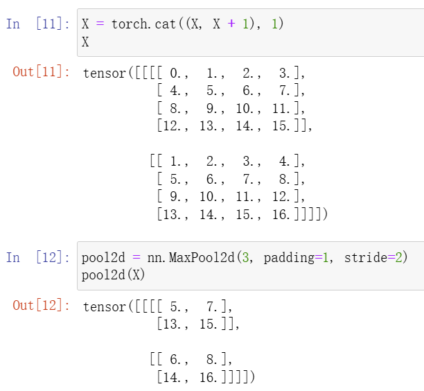

> 总结：
>
> - 卷积层
>       - 与稠密层相比，模型容量降低
>       - 有效地检测空间模式
>       - 计算复杂度高
>       - 通过填充，步幅和通道控制输出形状
> - 最大 / 平均汇聚层
>       - 提供一定程度的平移不变性

