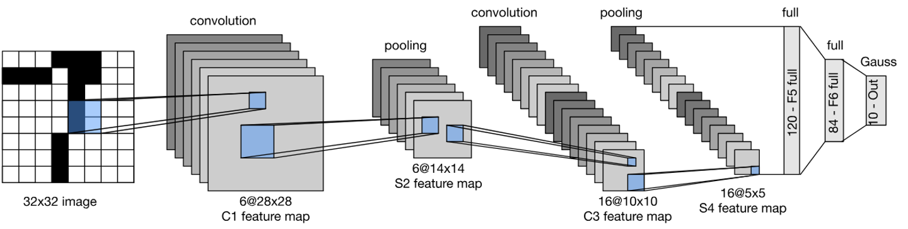
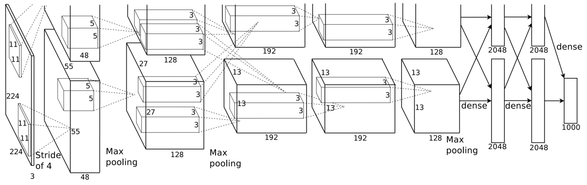
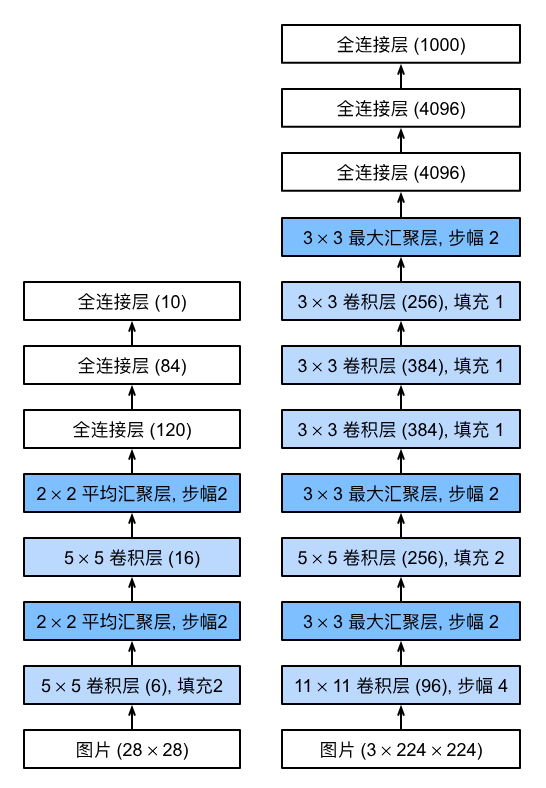
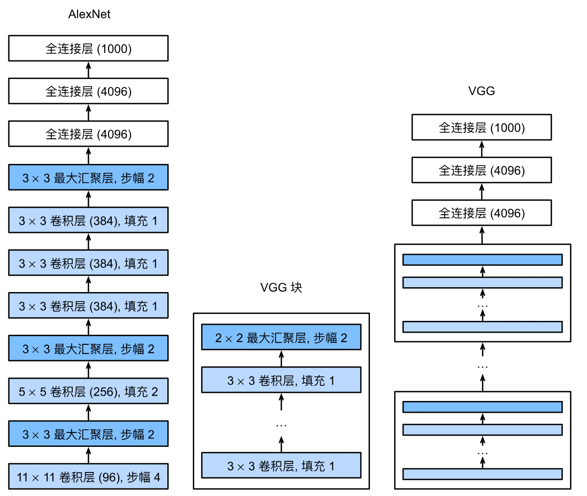
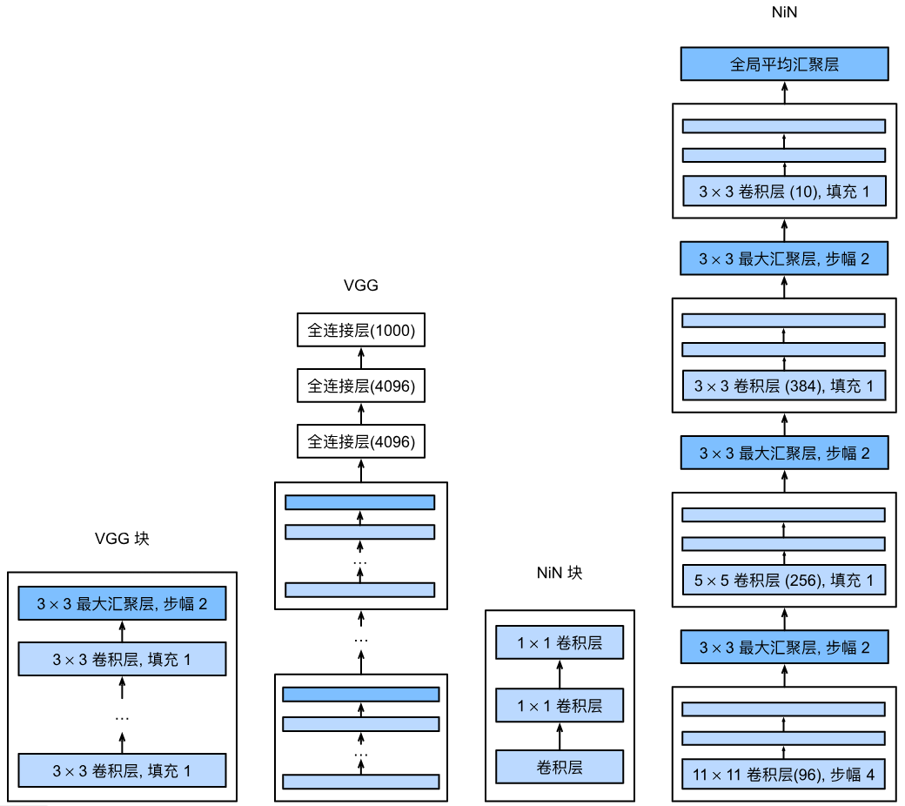

# LeNet, AlexNet, VGG 和 NiN

> 内容概述：
> 
> - LeNet（第一个卷积神经网络）
> - AlexNet
>       - 升级 版的 LeNet
>       - ReLu 激活， 丢弃法，平移不变性
> - VGG
>       - 升华版的 AlexNet
>       - 重复的 VGG 块
> - NiN
>       - 1x1 卷积 + 全局池化

## 13.1 LeNet



LeNet 是第一个卷积神经网络，它由两个卷积层(卷积编码器)和三个全连接层(全连接层稠密块)组成。用于手写数字识别，输入是 32x32 的灰度图像，输出是 10 个类别的概率。

|模块|组成层（按顺序）|关键参数/特点|
|---|---|---|
|卷积编码器|卷积层1 → Sigmoid → 平均池化 → 卷积层2 → Sigmoid → 平均池化|① 卷积核均为5×5，激活函数用Sigmoid（当时ReLU未出现）；<br>② 卷积层1输出6通道，卷积层2输出16通道；<br>③ 池化层为2×2平均池化（步幅2），空间分辨率减半；<br>④ 卷积层1加2像素填充（补偿5×5卷积核的尺寸损失），卷积层2无填充。|
|全连接密集块|Flatten → 全连接层1 → Sigmoid → 全连接层2 → Sigmoid → 全连接层3|① Flatten将4维特征（批量×通道×高×宽）展平为2维（批量×特征数）；<br>② 全连接层维度：16×5×5→120→84→10（10对应分类数，Fashion-MNIST为10类）；<br>③ 最后一层去掉了原始模型的高斯激活，直接输出分类概率。|

### LeNet的数据流（以28×28单通道输入为例）

```Plain Text

1×28×28（输入）→ 6×28×28（卷积1+填充）→ 6×14×14（平均池化）→ 16×10×10（卷积2）→ 16×5×5（平均池化）→ 400维（展平）→ 120维 → 84维 → 10维（输出）
```

核心规律：随着网络加深，**空间分辨率逐渐降低**（高/宽减小），**通道数逐渐增加**（从1→6→16），最后通过全连接层映射到分类维度。

### LeNet的训练要点

- 硬件：卷积计算成本高，优先使用GPU加速训练；

- 初始化：采用Xavier初始化卷积层和全连接层的权重（保证梯度稳定传播）；

- 优化器：小批量随机梯度下降（SGD）；

- 损失函数：交叉熵损失（适配分类任务）；

- 评估：需将数据移至GPU显存，通过`evaluate_accuracy_gpu`函数计算精度，训练中区分训练/评估模式（`net.train()`/`net.eval()`）。

### LeNet的核心意义与延伸

- 验证了卷积神经网络在计算机视觉任务的有效性，证明“保留空间结构”比展平图像的全连接网络更高效（参数更少、模型更简洁）；

- 确立了卷积神经网络的经典设计范式：**卷积（提取空间特征）→ 激活（引入非线性）→ 池化（降维+鲁棒性）→ 全连接（分类）**；

- 后续的CNN（如AlexNet、VGG）均基于LeNet的核心思想，仅在激活函数（ReLU替代Sigmoid）、池化方式（最大池化替代平均池化）、网络深度等方面优化。

## 13.2 AlexNet



### 13.2.1AlexNet的背景与突破性意义

1. **时代背景**：LeNet提出后，CNN因**数据规模小、硬件算力不足、训练技巧缺失**，在2012年前未主导计算机视觉领域；传统方法依赖手工设计特征（如SIFT/SURF），而AlexNet首次证明**学习到的特征可超越手工设计特征**。

2. **突破的核心条件**：

    - 数据：ImageNet数据集（百万级样本、1000类）提供了大规模标注数据，解决了深度模型的数据需求；

    - 硬件：GPU（如NVIDIA GTX580）的并行计算能力，解决了卷积/矩阵乘法的计算瓶颈；

3. **竞赛成绩**：2012年ImageNet挑战赛以绝对优势夺冠，打破计算机视觉研究格局，直接推动深度学习热潮。

### 13.2.2AlexNet与LeNet的核心差异（架构设计）



AlexNet继承LeNet“卷积+池化+全连接”的核心范式，但在规模和细节上大幅升级，核心差异如下：

|对比维度|LeNet（浅层）|AlexNet（深层）|
|---|---|---|
|网络深度|2卷积 + 2全连接（共4层）|5卷积 + 2全连接 + 1输出层（共8层）|
|卷积窗口|固定5×5|多尺度（11×11→5×5→3×3）|
|卷积通道数|少（如6/16）|多（如96/256/384，是LeNet的10倍）|
|池化层|2×2池化|3×3最大池化（步幅2）|
|全连接层规模|小（120→84）|超大（4096×2，参数近1GB）|
|激活函数|Sigmoid|ReLU（核心改进）|
|正则化方式|仅权重衰减|Dropout（全连接层）+ 权重衰减|

### 13.2.3AlexNet的关键技术创新

1. **ReLU激活函数**：

    - 计算更简单（无需Sigmoid的幂运算）；

    - 正区间梯度恒为1，解决Sigmoid在饱和区的**梯度消失**问题，降低参数初始化难度。

2. **Dropout暂退法**：

    - 作用于全连接层，随机丢弃50%神经元（`p=0.5`）；

    - 核心作用：控制模型复杂度，减少过拟合。

3. **数据增强**：

    - 训练时对图像做翻转、裁切、变色等操作，扩充样本量；

    - 效果：提升模型健壮性，缓解过拟合。

4. **GPU并行计算**：

    - 利用双GPU并行处理卷积/矩阵乘法，大幅提升训练效率；

    - 标志性成果：cuda-convnet成为行业标准，解决了深度CNN的算力瓶颈。

### 13.2.4工程实现要点

1. 输入适配：ImageNet图像分辨率为224×224，故第一层用11×11大卷积窗口+步幅4，适配大尺寸输入；

2. 填充策略：卷积层使用padding保证输入输出尺寸匹配（如5×5卷积padding=2）；

3. 数据集适配：示例中因使用Fashion-MNIST（28×28），需resize到224×224，输出层类别改为10（原论文为1000）；

4. 训练细节：使用更小的学习率（0.01），因网络更深、图像分辨率更高，训练成本显著增加。

## 13.3 VGG

### 13.3.1 核心设计思想（VGG的灵魂）

- **模块化/块化设计**：VGG首次系统性地将「卷积层+激活层+池化层」封装为可复用的**VGG块**，摆脱了逐一层堆叠的低效方式，让网络架构设计更抽象、更易扩展。

- **小卷积核替代大卷积核**：用多个3×3的小卷积核（带padding=1保持分辨率）替代大卷积核（如7×7、5×5），例如2个3×3卷积层的感受野等价于1个5×5卷积层，3个3×3等价于1个7×7。

    - 优势：**减少参数数量**（3×3×3=27 < 7×7=49）、**增加非线性**（多一层ReLU激活），同时保持相同的感受野。

- **分辨率逐级下采样**：每个VGG块末尾用2×2最大池化（stride=2），让特征图的高/宽每次减半，通道数逐级翻倍（64→128→256→512→512）。

### 13.3.2 网络结构（以VGG-11为例）



VGG网络分为两大部分，结构清晰且可复用：

|部分|组成|关键细节|
|---|---|---|
|卷积特征提取|5个VGG块（前2块各1个卷积层，后3块各2个卷积层）+ 池化层|输入：224×224单/三通道；输出：7×7×512的特征图（5次池化后分辨率从224→7）|
|全连接分类|3个全连接层（4096→4096→10）+ ReLU + Dropout(0.5) + Flatten|Flatten将7×7×512展平为25088维向量；Dropout防止过拟合|
- VGG-11的命名：8个卷积层 + 3个全连接层 = 11个可训练层（这是VGG系列命名的规则，如VGG-16=13个卷积+3个全连接）。

### 13.3.3 关键特性（与AlexNet对比）

|对比维度|AlexNet|VGG-11|
|---|---|---|
|卷积核|7×7（第一层）+ 3×3|全3×3|
|架构灵活性|逐一层堆叠，无模块化|块化设计，可灵活调整块数/卷积层数|
|参数效率|大卷积核参数多|小卷积核参数少，效率更高|
|复杂度|中等|更高（特征提取更充分）|
### 13.3.4 实践要点（代码/训练层面）

- **VGG块的实现**：核心函数`vgg_block(num_convs, in_channels, out_channels)`，通过循环堆叠指定数量的卷积层，最后拼接池化层，返回`nn.Sequential`模块。

- **通道数缩放**：实际训练（如Fashion-MNIST）时，可按比例缩小通道数（如`ratio=4`），降低计算量（原始VGG通道数大，小数据集无需全量参数）。

- **输入适配**：VGG要求输入分辨率为224×224，因此处理MNIST（28×28）时需`resize=224`。

- **训练技巧**：使用略高的学习率（如0.05），利用GPU加速（VGG计算量比AlexNet大），Dropout(0.5)抑制过拟合。

### 13.3.5总结

1. **设计核心**：VGG的精髓是「块化复用+小卷积核+逐级下采样」，让网络架构更简洁、参数更高效；

2. **结构关键**：VGG-11由5个模块化VGG块+3个全连接层组成，特征图分辨率逐级减半、通道数逐级翻倍；

3. **实践要点**：小卷积核替代大卷积核是核心技巧，实际应用中可缩放通道数适配小数据集，降低计算成本。

### 13.3.6 进程

**LeNet**：2卷积层+汇聚层+2隐藏层

**AlexNet**:：更大更深的LeNet、ReLU激活函数、Dropout暂退法、数据增强、GPU并行计算

**VGG**：更大更深的AlexNet（重复的VGG）

## 13.4网络中的网络NiN

NiN是卷积神经网络发展中的关键里程碑，核心创新是**用逐像素的多层感知机替代全连接层**，彻底改变了传统CNN的收尾方式。以下从「核心设计思想、网络结构、关键特性、实践要点」四个维度梳理核心知识点：

### 13.4.1 核心设计思想（NiN的灵魂）

- **逐像素MLP（1×1卷积的核心价值）**：

NiN的核心创新是在每个空间像素位置（高度×宽度）上，对通道维度应用多层感知机（MLP）。具体通过**1×1卷积层**实现：

- 1×1卷积不改变特征图的高/宽，仅对每个像素的通道做线性变换+ReLU激活，相当于“逐像素全连接”；

- 一个NiN块包含「普通卷积层 + 两个1×1卷积层」，让每个像素的特征表达更具非线性，同时不破坏空间结构。

- **移除全连接层，改用全局平均池化**：

传统CNN（LeNet/AlexNet/VGG）依赖全连接层做分类，但全连接层参数多、易过拟合；NiN直接将最后一个NiN块的输出通道数设为类别数，再通过**全局自适应平均池化（AdaptiveAvgPool2d）** 将每个通道的特征图压缩为1×1，最后展平即可输出分类结果。

### 13.4.2 网络结构（NiN的整体架构）



NiN的结构可分为“特征提取”和“分类收尾”两部分，完全复用模块化设计：

|部分|组成|关键细节|
|---|---|---|
|特征提取|4个NiN块 + 3个MaxPool2d（3×3，stride=2） + Dropout(0.5)|卷积核尺寸：11×11→5×5→3×3→3×3；输出通道：96→256→384→10（类别数）；池化后分辨率逐级降低|
|分类收尾|AdaptiveAvgPool2d((1,1)) + Flatten|AdaptiveAvgPool2d：无论输入特征图尺寸是多少，都输出1×1；Flatten将10×1×1展平为10维向量|


- 输入：224×224单通道（Fashion-MNIST）；

- 输出：10维向量（对应10个类别）；

- 关键尺寸变化（以输入224×224为例）：

224→54（11×11卷积，stride=4）→26（3×3池化）→26（5×5卷积，padding=2）→12（池化）→12（3×3卷积）→5（池化）→5（最后一个NiN块）→1×1（全局池化）。

### 13.4.3 关键特性（与AlexNet/VGG对比）

|对比维度|AlexNet/VGG|NiN|
|---|---|---|
|分类层|全连接层（参数多、易过拟合）|全局平均池化+1×1卷积（无全连接，参数少）|
|特征增强|仅卷积层+激活层|卷积层+两层1×1卷积（逐像素MLP，非线性更强）|
|参数规模|大（仅全连接层就占大量参数）|小（移除全连接层，参数减少50%以上）|
|训练效率|快（全连接层计算简单）|稍慢（1×1卷积增加逐像素计算量）|
|过拟合风险|高（全连接层易记住噪声）|低（无全连接层，Dropout进一步抑制过拟合）|

### 13.4.4 实践要点（代码/训练层面）

- **NiN块的实现**：核心函数`nin_block(in_channels, out_channels, kernel_size, strides, padding)`，固定拼接「普通卷积+ReLU + 1×1卷积+ReLU + 1×1卷积+ReLU」，返回`nn.Sequential`模块。

- **AdaptiveAvgPool2d的优势**：无需手动计算池化核尺寸，输入特征图是5×5或7×7都能输出1×1，适配性更强。

- **训练技巧**：

    - 学习率可设为0.1（比VGG稍高），batch_size=128，epoch=10；

    - 加入Dropout(0.5)进一步抑制过拟合；

    - 输入需resize到224×224（与AlexNet/VGG一致）。

### 13.4.5 总结

1. **设计核心**：NiN的核心是「1×1卷积实现逐像素MLP」+「全局平均池化替代全连接层」，既增强了特征表达，又大幅减少参数、降低过拟合；

2. **结构关键**：NiN由模块化的NiN块组成，卷积核逐级缩小，通道数先增后减至类别数，最后通过自适应池化收尾；

3. **实践价值**：NiN是首个彻底抛弃全连接层的经典CNN，其1×1卷积和全局池化的设计被ResNet、GoogLeNet等后续网络广泛借鉴。

## 13.5 总结

- LeNet 第一个卷积神经网络
- AlexNet  升级版的LeNet、ReLU激活、丢弃法、平移不变性
- VGG   升华版的AlexNet、重复的VGG
- NiN  引入1×1卷积、全局池化、无全连接层，首次彻底抛弃全连接层