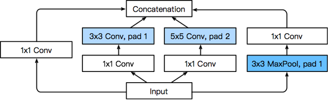
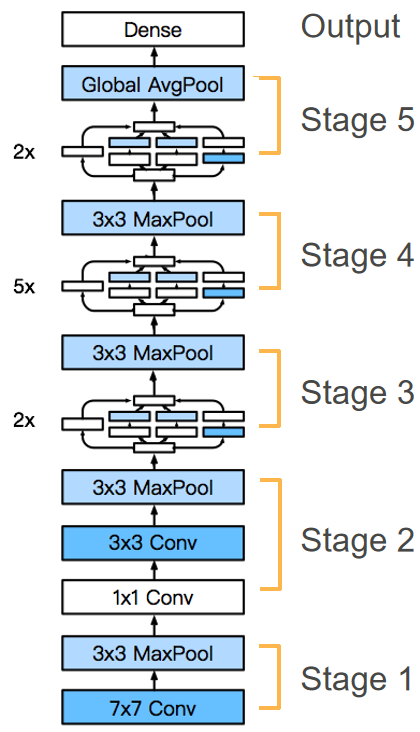
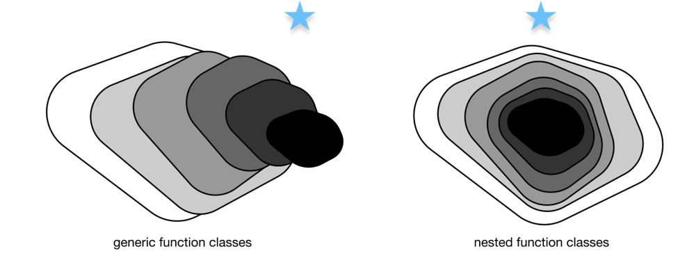
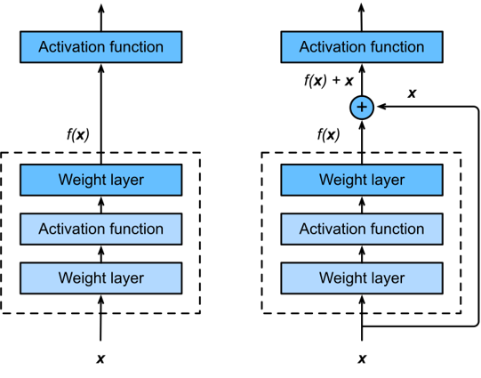
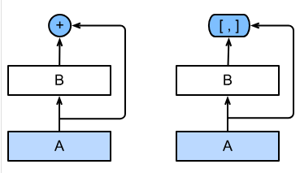

# 14.GoogLeNet、批量规范化、ResNet、DenseNet.md

> 内容概述：
> 
> - GoogLeNet
> - 批量规范化
> - ResNet
> - DenseNet

## 14.1 GoogLeNet（含并行连结的网络）

### 14.1.1Inception块（核心组件）



Inception块是GoogLeNet的核心创新，通过**四条并行路径**提取不同尺度的特征，兼顾特征多样性和计算效率：

1. **路径设计**：

    - 路径1：1×1卷积层（直接提取小尺度特征，减少计算量）；

    - 路径2：1×1卷积层 → 3×3卷积层（先降维再提取中等尺度特征）；

    - 路径3：1×1卷积层 → 5×5卷积层（先降维再提取大尺度特征）；

    - 路径4：3×3最大池化 → 1×1卷积层（保留空间结构，同时调整通道数）。

2. **关键技巧**：

    - 所有路径通过**填充**保证输出高/宽与输入一致；

    - 最终在**通道维度**拼接四条路径的输出；

    - 1×1卷积的核心作用：降维（减少后续卷积的计算量）、跨通道信息融合。

### 14.1.2GoogLeNet整体架构



1. **结构特点**：

    - 由9个Inception块 + 卷积层/池化层串联组成；

    - 用**最大池化层**降低特征图维度（替代全连接层的降维作用）；

    - 最后使用**全局平均池化层**（AdaptiveAvgPool2d((1,1))）将每个通道压缩为1×1，避免全连接层的大量参数；

    - 仅在最后接一个简单的全连接层输出分类结果（如Fashion-MNIST的10类）。

2. **维度变化（以96×96输入为例）**：

输入(1,1,96,96) → 经多轮Inception块/池化层 → 输出(1,1024) → 全连接层→(1,10)。

### 14.1.3GoogLeNet的核心优势

1. **多尺度特征融合**：不同大小的卷积核（1×1/3×3/5×5）捕捉不同范围的图像细节，提升特征表达能力；

2. **高效计算**：通过1×1卷积降维，在增加特征维度的同时控制整体计算复杂度（比VGG参数更少）；

3. **避免过拟合**：全局平均池化替代全连接层，减少参数数量，降低过拟合风险。

### 14.1.4训练注意事项

1. 输入尺寸：原论文用224×224，为简化训练（如Fashion-MNIST）可缩放到96×96；

2. 梯度稳定：早期版本需添加“辅助分类器”稳定训练，现代优化器（如SGD/Adam）可省略；

3. 常见问题：训练中出现`loss nan`通常是学习率过高（可调低lr，如0.01）或梯度爆炸，需配合梯度裁剪/批量归一化。

### 14.1.5关键点回顾

1. Inception块通过4条并行路径实现多尺度特征提取，1×1卷积是降维提效的核心；

2. GoogLeNet用全局平均池化替代全连接层，大幅减少参数和计算量；

3. 整体思路：融合多尺度特征 + 高效计算设计，在精度和效率间取得平衡。

## 14.2 批量规范化

### 14.2.1批量规范化的核心目标

解决深层神经网络训练的三大痛点：

1. **数据分布偏移**：训练过程中中间层的输入分布随参数更新不断变化（内部协变量偏移），导致模型收敛慢、学习率难以调整；

2. **梯度不稳定**：深层网络中，靠前层的微小参数变化会被放大，导致梯度爆炸/消失；

3. **正则化需求**：辅助降低过拟合风险（小批量统计带来的噪声相当于弱正则化）。

### 14.2.2批量规范化的核心原理

1. **核心公式**：

对小批量数据  $X$  做标准化，再通过可学习的拉伸（ $\gamma$ ）和偏移（ $\beta$ ）参数恢复表达能力：

 $Y = \gamma \cdot \frac{X - \mu_B}{\sqrt{\sigma_B^2 + \epsilon}} + \beta$ 

-  $\mu_B$ ：小批量均值， $\sigma_B^2$ ：小批量方差（加  $\epsilon$  避免除零）；

-  $\gamma$ （初始1）、 $\beta$ （初始0）：与模型参数一起训练，让网络自主决定是否保留标准化后的分布。

2. **训练/预测模式差异**：

|    模式|    均值/方差来源|    目的|
|---|---|---|
|    训练|    当前小批量的统计值|    利用批量噪声做弱正则化|
|    预测|    训练过程中累积的移动平均|    保证预测结果稳定|

3. **不同层的适配**：

    - **全连接层**：对特征维度（dim=0）计算均值/方差；

    - **卷积层**：对通道维度（dim=1）计算均值/方差（所有空间位置共享同一套统计值）。

### 14.2.3批量规范化的实现要点

1. **手动实现逻辑**：

    - 区分训练/预测模式（通过 `torch.is_grad_enabled()`）；

    - 维护移动均值/方差（`moving_mean`/`moving_var`），用 `momentum` 平滑更新；

    - 适配全连接（2维）/卷积（4维）输入的维度计算。

2. **框架原生API**：

    - 全连接层：`nn.BatchNorm1d(num_features)`；

    - 卷积层：`nn.BatchNorm2d(num_channels)`；

    - 无需手动维护移动均值/方差，框架自动处理。

3. **使用位置**：

通常放在**卷积/全连接层之后、激活函数之前**（如 LeNet 中：Conv → BatchNorm → Sigmoid）。

### 14.2.4批量规范化的实践价值

1. **加速收敛**：允许使用更大的学习率（如示例中 lr=1.0），训练速度提升显著；

2. **稳定训练**：降低对初始化、学习率的敏感度，更容易训练深层网络（如ResNet）；

3. **弱正则化**：小批量统计的噪声减少过拟合（但不能替代Dropout/权重衰减）；

4. **争议点**：原论文提出的“减少内部协变量偏移”并非核心原因，其有效性更多来自梯度稳定和正则化作用。

### 14.2.5关键注意事项

1. **批量大小**：小批量过小时（如batch_size=1），均值/方差无意义，批量规范化失效；

2. **推理阶段**：必须使用训练时累积的移动均值/方差（框架自动切换，无需手动干预）；

3. **参数初始化**： $\gamma$  初始为1、 $\beta$  初始为0，保证初始状态等价于“无批量规范化”。

### 14.2.6关键点回顾

1. 批量规范化通过标准化小批量数据稳定中间层分布，加速深层网络收敛；

2. 训练/预测模式使用不同的均值/方差来源，框架API已封装该逻辑；

3. 核心价值是梯度稳定+弱正则化，“内部协变量偏移”并非其有效核心解释。

## 14.3 残差网络



### 14.3.1ResNet的核心动机

解决**深层网络训练退化问题**：



1. 传统深层网络（如VGG）层数增加到一定程度后，训练误差和测试误差反而上升（并非过拟合，而是梯度消失/爆炸导致无法有效学习）；

2. 核心假设：如果能让新增层**轻松拟合恒等映射**（ $f(x)=x$ ），那么深层网络的性能至少不低于浅层网络，甚至更好；

3. 实现思路：将“直接拟合目标映射  $f(x)$ ”转为“拟合残差映射  $f(x)-x$ ”（残差），当目标映射接近恒等映射时，残差映射只需拟合接近0的函数，更容易优化。

### 14.3.2残差块（Residual Block）—— ResNet的核心组件

1. **结构设计**：

    - 基础版：2个3×3卷积层（同通道数、同分辨率） + 批量规范化 + ReLU，输入通过**跨层捷径连接（shortcut）** 直接加到第二个卷积层的输出上，最后接ReLU；

    - 扩展版（调整通道/分辨率）：当需要改变输出通道数或减半分辨率时，捷径连接中加入1×1卷积层（调整输入的通道数和步幅），保证输入与卷积输出形状匹配以完成相加。

2. **关键代码逻辑**：

    ```Python
    
    # 核心相加操作：卷积输出 + 输入（或经过1×1卷积的输入）
    Y += X  # 残差连接的核心
    return F.relu(Y)
    ```

3. **形状适配规则**：

    - 同形状：直接相加（use_1x1conv=False，strides=1）；

    - 升通道+降分辨率：1×1卷积调整输入（use_1x1conv=True，strides=2）。

### 14.3.3ResNet整体架构（以ResNet-18为例）

1. **分层设计**：

|    模块|    结构|    输出形状变化（输入224×224）|
|---|---|---|
|    b1|    7×7卷积（64通道，stride=2）+ BN + ReLU + 3×3最大池化（stride=2）|    224×224 → 56×56（64通道）|
|    b2-b5|    4个残差块模块（每个模块2个残差块）|    b2：56×56（64）→ b3：28×28（128）→ b4：14×14（256）→ b5：7×7（512）|
|    输出层|    全局平均池化 + Flatten + 全连接层（10类）|    7×7×512 → 512 → 10|
2. **核心特点**：

    - 分辨率逐层减半，通道数逐层翻倍（64→128→256→512）；

    - 所有卷积层后均接批量规范化，提升训练稳定性；

    - 无全连接层（除最后输出），用全局平均池化减少参数，避免过拟合。

### 14.3.4ResNet的核心优势

1. **解决梯度消失/爆炸**：捷径连接为梯度提供“直通路”，梯度可直接从输出层传递到浅层，避免深层梯度趋近于0；

2. **嵌套函数学习**：保证深层网络至少能复现浅层网络的性能（只需让新增残差块拟合恒等映射），层数增加不会导致性能退化；

3. **架构简洁**：相比GoogLeNet的Inception块，残差块设计更简单，易于扩展（如ResNet-50/101/152仅需调整残差块内的卷积结构）。

### 14.3.5实践注意事项

1. **批量规范化**：残差块中卷积层后必须接BN，否则训练稳定性大幅下降；

2. **捷径连接的形状匹配**：必须保证相加的两个张量形状完全一致（通道数、高、宽）；

3. **数据集适配**：训练时需将输入resize到合适尺寸（如Fashion-MNIST resize到96×96，ImageNet用224×224）。

### 14.3.6关键点回顾

1. ResNet通过**残差映射**替代直接映射，解决深层网络训练退化问题，核心是“拟合残差  $f(x)-x$  比拟合  $f(x)$  更容易”；

2. 残差块的**跨层捷径连接**是核心设计，既可以直接连接（同形状），也可通过1×1卷积调整形状（升通道/降分辨率）；

3. ResNet架构遵循“分辨率减半、通道数翻倍”的规律，结合批量规范化和全局平均池化，成为深层网络设计的经典范式。

## 14.4 DenseNet

### 14.4.1稠密连接网络（DenseNet）

DenseNet是ResNet的逻辑扩展，核心是通过**通道维度的稠密连接**充分复用特征，下面从核心思想、关键组件、模型结构三个维度拆解知识点：

#### 14.4.1.1核心思想：从ResNet到DenseNet的进化



ResNet的核心是“残差连接”：将输入和输出**相加**（恒等映射 + 残差），公式为  $H(x) = x + F(x)$ ，本质是把函数分解为“简单线性项 + 复杂非线性项”；

DenseNet则进一步，将每一层的输入与前面**所有层的输出在通道维度拼接（concat）**，核心公式为：

 $x_l = H_l([x_0, x_1, ..., x_{l-1}])$ 

其中  $[x_0, x_1, ..., x_{l-1}]$  表示前面所有层的特征图在通道维度拼接，这种“每层都与之前所有层连接”的方式就是“稠密连接”，能更充分地复用特征。

#### 14.4.1.2 DenseNet的两大核心组件

##### 1. 稠密块（DenseBlock）

- **作用**：实现核心的稠密连接，是DenseNet的特征提取单元；

- **结构**：由多个“BN → ReLU → 3×3卷积”的卷积块组成；

- **关键细节**：

    - 每个卷积块的输入通道数 = 初始输入通道数 + 前面所有卷积块的输出通道数之和；

    - **增长率（growth rate）**：每个卷积块的输出通道数（代码中`num_channels`），控制通道数的增长速度（比如增长率为32，4个卷积块的稠密块会增加128个通道）。

代码核心逻辑：

```Python

def forward(self, X):
    for blk in self.net:
        Y = blk(X)
        # 通道维度拼接：当前输入X + 卷积块输出Y
        X = torch.cat((X, Y), dim=1)
    return X
```

##### 2. 过渡层（Transition Block）

- **作用**：解决稠密块导致的通道数持续膨胀问题，控制模型复杂度；

- **结构**：BN → ReLU → 1×1卷积（降通道） → 2×2平均池化（降高/宽，步幅2）；

- **关键细节**：

    - 1×1卷积：将通道数减半（代码中`num_channels // 2`），减少计算量；

    - 平均池化：将特征图的高和宽减半，进一步降低模型规模。

#### 14.4.1.3 DenseNet完整模型结构

DenseNet的整体结构与ResNet类似，但用“稠密块+过渡层”替代了残差块，具体流程：

1. **初始层**：7×7卷积（步幅2）→ BN → ReLU → 3×3最大池化（步幅2）（与ResNet一致）；

2. **主体层**：4个稠密块，块之间插入过渡层（最后一个稠密块后无过渡层）；

3. **输出层**：BN → ReLU → 全局自适应平均池化（将特征图转为1×1） → Flatten → 全连接层（分类）。

核心流程示例（代码）：

```Python

# 初始层
b1 = nn.Sequential(
    nn.Conv2d(1, 64, kernel_size=7, stride=2, padding=3),
    nn.BatchNorm2d(64), nn.ReLU(),
    nn.MaxPool2d(kernel_size=3, stride=2, padding=1))

# 4个稠密块+过渡层（最后一个块无过渡层）
num_channels, growth_rate = 64, 32  # 初始通道64，增长率32
num_convs_in_dense_blocks = [4, 4, 4, 4]  # 每个稠密块4个卷积块
blks = []
for i, num_convs in enumerate(num_convs_in_dense_blocks):
    blks.append(DenseBlock(num_convs, num_channels, growth_rate))
    num_channels += num_convs * growth_rate  # 更新通道数
    if i != 3:  # 前3个稠密块后加过渡层
        blks.append(transition_block(num_channels, num_channels // 2))
        num_channels = num_channels // 2

# 输出层
net = nn.Sequential(
    b1, *blks,
    nn.BatchNorm2d(num_channels), nn.ReLU(),
    nn.AdaptiveAvgPool2d((1, 1)),  # 全局池化
    nn.Flatten(),
    nn.Linear(num_channels, 10))  # 分类头
```

#### 14.4.1.4 训练要点

- 为简化计算，通常将输入图片尺寸从224×224降到96×96；

- 优化器常用SGD，学习率初始设为0.1，训练过程中可按需衰减；

- 由于特征复用充分，DenseNet在小数据集（如Fashion-MNIST）上也能取得较好效果（测试准确率约88%+）。

### 14.4.1.5 总结

1. **核心连接方式**：DenseNet与ResNet的核心区别是“通道拼接”而非“特征相加”，实现每层与前面所有层的稠密连接，充分复用特征；

2. **关键组件**：稠密块实现特征复用（增长率控制通道增长），过渡层通过1×1卷积和平均池化控制模型复杂度（降通道、降尺寸）；

3. **模型结构**：初始层+4个稠密块（块间过渡层）+全局池化+全连接层，整体结构简洁且特征利用效率高。