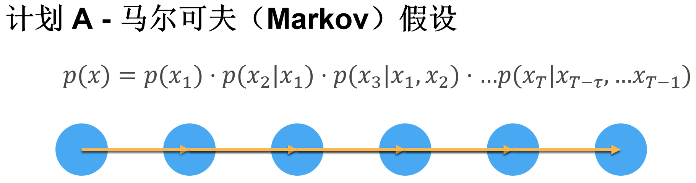
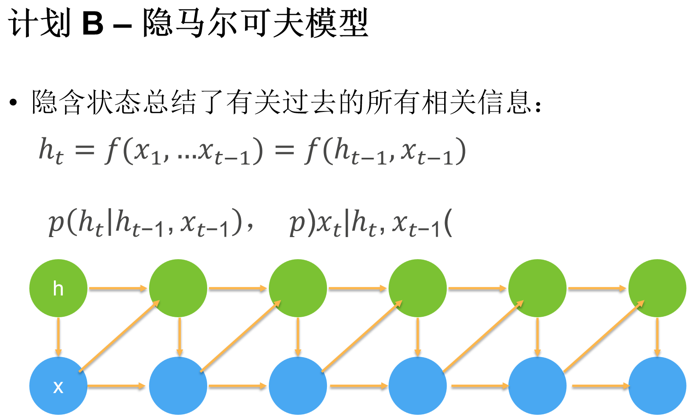

# 15.序列模型

> 内容概述:
>
> - 马尔可夫模型
> - 类隐马尔可夫模型

## 15.1 核心背景与问题定义

1. **序列数据的特点**：

    - 时序性：数据顺序不可随意调换（如“人咬狗”≠“狗咬人”）；

    - 动态性：数据分布可能随时间变化（如电影评分、股价）；

    - 预测难度：外推法（预测未来，如明天股价）远难于内插法（补全中间值）。

2. **核心预测目标**：

已知时间步  $1,2,...,t$  的观测值  $x_1,x_2,...,x_t$ ，估计下一时间步的取值  $x_{t+1}$ ，公式为：

 $\hat{x}_{t+1} = P(x_{t+1} \mid x_t, x_{t-1}, ..., x_1)$ 

## 15.2 序列模型的两大核心思路

##### 1. 自回归模型（Autoregressive Models）

- **核心思想**：用**有限长度的历史观测值**替代全部历史，简化计算（解决“输入维度随时间增长”的问题）；

- **具体做法**：假设仅需最近  $τ$  个时间步的观测值即可预测下一个值，即：

     $\hat{x}_{t+1} = P(x_{t+1} \mid x_t, x_{t-1}, ..., x_{t-τ+1})$ 

- **优势**：输入维度固定（始终为  $τ$ ），可直接用传统神经网络（如MLP）训练；

- **特殊情况：马尔可夫模型**：

若  $τ=1$ （仅用前1个时间步预测），则为**一阶马尔可夫模型**，满足马尔可夫条件（未来仅依赖当前，与更早的历史无关），公式为：

 $\hat{x}_{t+1} = P(x_{t+1} \mid x_t)$ 

##### 2. 隐变量自回归模型（Latent Autoregressive Models）

- **核心思想**：用**隐变量 ** $h_t$  ** 总结历史信息**，同时更新“预测值”和“历史总结”；

- **具体做法**：

    - 预测： $\hat{x}_{t+1} = P(x_{t+1} \mid h_t)$ ；

    - 更新隐变量： $h_{t+1} = g(h_t, x_{t+1})$ ；

- **优势**：隐变量可自适应捕捉关键历史信息，无需手动指定  $τ$ （后续RNN、LSTM、Transformer均属于此类）。

## 15.3 关键训练与预测细节

##### 1. 训练数据构造

- 将序列数据转换为“特征-标签对”：以  $τ=4$  为例，特征为  $[x_1,x_2,x_3,x_4]$ ，标签为  $x_5$ ；特征为  $[x_2,x_3,x_4,x_5]$ ，标签为  $x_6$ ，依此类推；

- 假设前提：序列动力学是**静止的**（即数据的生成规律不随时间改变），否则无法用历史数据预测未来。

##### 2. 预测类型与误差问题

|预测类型|定义|效果|
|---|---|---|
|单步预测|用真实历史数据预测下一个时间步|效果好|
|多步预测|用模型自身的预测结果继续预测更远未来|误差快速累积|

- **误差累积原理**：多步预测中，每一步的预测误差会作为输入传递到下一步，导致误差呈指数级放大（如天气预报超过72小时精度骤降）。

## 15.4 实践验证（代码核心逻辑）

以正弦函数+噪声生成的序列为例，用MLP实现自回归模型：

```Python

import torch
from torch import nn
from d2l import torch as d2l

# 1. 生成序列数据
T = 1000
time = torch.arange(1, T + 1, dtype=torch.float32)
x = torch.sin(0.01 * time) + torch.normal(0, 0.2, (T,))

# 2. 构造特征-标签对（tau=4）
tau = 4
features = torch.zeros((T - tau, tau))
for i in range(tau):
    features[:, i] = x[i: T - tau + i]
labels = x[tau:].reshape((-1, 1))

# 3. 定义简单MLP模型
def get_net():
    net = nn.Sequential(nn.Linear(4, 10), nn.ReLU(), nn.Linear(10, 1))
    net.apply(lambda m: nn.init.xavier_uniform_(m.weight) if type(m) == nn.Linear else None)
    return net

# 4. 训练模型
def train(net, train_iter, loss, epochs, lr):
    trainer = torch.optim.Adam(net.parameters(), lr)
    for epoch in range(epochs):
        for X, y in train_iter:
            trainer.zero_grad()
            l = loss(net(X), y)
            l.sum().backward()
            trainer.step()

# 5. 单步/多步预测
# 单步预测：用真实特征预测，效果好
onestep_preds = net(features)
# 多步预测：用自身预测结果迭代，误差累积
multistep_preds = torch.zeros(T)
multistep_preds[:n_train+tau] = x[:n_train+tau]
for i in range(n_train+tau, T):
    multistep_preds[i] = net(multistep_preds[i-tau:i].reshape((1, -1)))
```

## 15.5 核心结论

- 序列模型的核心是**简化历史依赖的建模**（自回归用固定长度历史，隐变量用总结信息）；

- 因果性：时间向前的方向是自然的预测方向（未来无法影响过去），正向建模更简单；

- 多步预测的瓶颈：误差累积导致预测质量随步数增加极速下降（后续RNN/LSTM/Transformer会通过优化结构缓解此问题）。

### 总结

1. **核心建模思路**：序列预测的关键是简化历史依赖，主流方式为“自回归模型（固定长度历史）”和“隐变量自回归模型（动态总结历史）”；

2. **预测特性**：单步预测（用真实数据）效果好，多步预测（用预测结果迭代）易因误差累积失效；

3. **训练前提**：需假设序列动力学静止（生成规律不变），且训练时必须尊重时间顺序（不能用未来数据训练）。



