# 16. 注意力机制

> 内容概述：
>
> 注意力机制

# 补充
## Seq2Seq与注意力机制

- 添加额外的注意层以编码器的输出作为存储器
- 注意力的输出用作解码器的输入

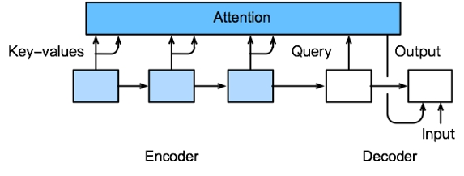

## 编码器-解码器注意力机制

- 使用编码器中的最后一个循环神经网络层的输出
- 然后注意力输出与嵌入输出拼接，以输入解码器中的第一个循环神经网络

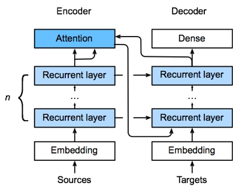

# 注意力提示

## 一、核心思想：注意力是稀缺资源
- 注意力是有限、稀缺、有价值的资源，有机会成本。
- 环境信息远大于大脑处理能力，必须选择性关注。
- 注意力分配 = 资源最优分配，是 “注意力经济”。

## 二、生物学中的两类注意力提示
### 1、非自主性提示（被动）

基于突出性、显眼性；不受主观控制，环境自动吸引注意力（如红色杯子）。

### 2、自主性提示（主动）
由主观意愿、任务目标、认知驱动；有意识地选择关注对象（如主动看书）。
## 三、注意力机制的核心框架：Query / Key / Value

Query（查询） = 自主性提示（我想要什么）

Key（键） = 非自主性提示（输入本身的特征）

Value（值） = 实际要被加权聚合的感官输入

机制：

通过 Query 与 Key 的匹配 计算注意力权重，再对 Value 做加权平均（注意力汇聚）。

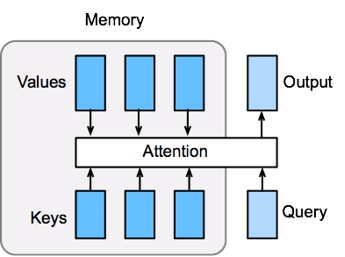

- 它的存储器（memory）有键值对组成。
- 键和查询越相似，则输出值约接近。

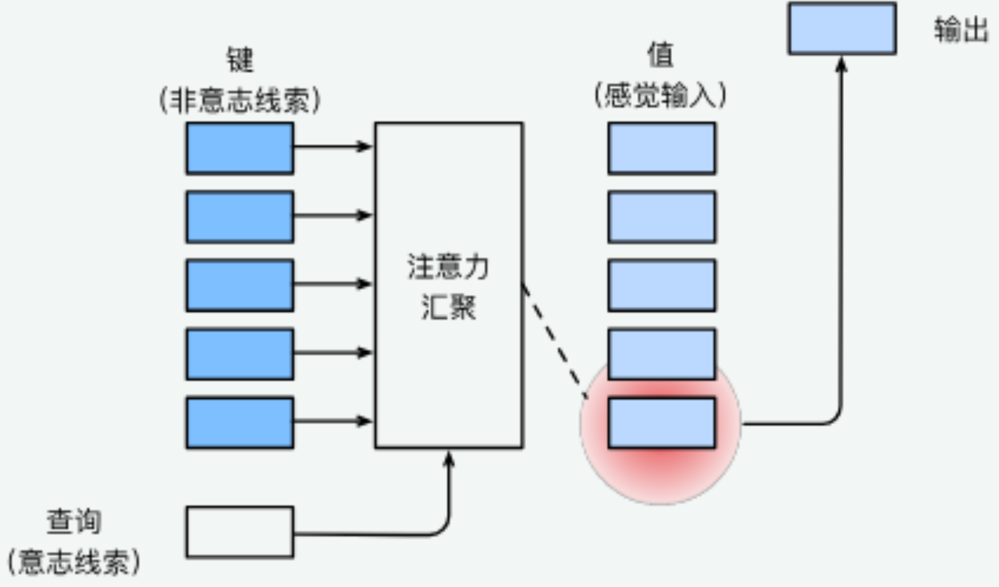

## 四、与全连接 / 汇聚层的本质区别
全连接 / 汇聚层：无自主提示，固定 / 均匀加权。
注意力机制：加入 Query（自主意图），实现动态、自适应加权。
## 五、注意力权重与可视化

注意力本质：加权平均，权重由 Query 和 Key 计算。

可用热图（heatmap） 直观展示：

- 行：Queries
- 列：Keys
- 颜色深浅：注意力权重大小

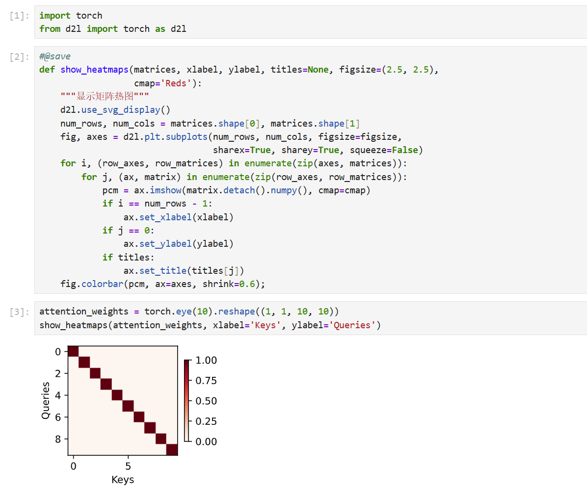

# 注意力汇聚：Nadaraya-Watson 核回归

## 一、核心定位：NW核回归的角色

Nadaraya-Watson（NW）核回归是**注意力机制的极简实践范例**——用回归任务直观演示了“注意力汇聚”的核心逻辑（对值的加权平均）。

## 二、注意力汇聚的本质（核心）

注意力汇聚 ≠ 平均汇聚：

- 平均汇聚：对所有值**均等加权**（无注意力区分），预测效果差；

- 注意力汇聚：对值**动态加权平均**，权重由「查询（Query）与键（Key）的相似度」决定（越相似，权重越高）。

## 三、两类注意力汇聚（NW核回归的两种形式）

|类型|核心特点|公式（高斯核）|预测效果|
|---|---|---|---|
|非参数版|无可学习参数，纯依赖数据|权重 = softmax(-(Query-Key)²/2)|曲线平滑，数据足够时收敛到最优|
|带参数版|加入可学习参数 `w`|权重 = softmax(-((Query-Key)×w)²/2)|曲线更贴合带噪声的训练数据（不平滑）|

### 关键细节：

1. 非参数版：注意力权重“随Query-Key距离递减”，热图呈现**对角线集中**（越近权重越高）；

2. 带参数版：可学习参数 `w` 能调整相似度的“敏感度”，训练后权重集中度更高，曲线更贴合训练数据。

## 四、关键技术：批量矩阵乘法（bmm）

### 1. 作用

高效计算**小批量数据的注意力加权平均**（避免逐样本计算，提升效率）。

### 2. 形状规则

若输入张量形状为 `(B, m, k)` 和 `(B, k, n)`，批量矩阵乘法输出为 `(B, m, n)`（B=批量大小）。

### 3. 注意力场景应用

权重（`B, 查詢数, 键数`） × 值（`B, 键数, 1`）→ 加权后的预测值（`B, 查詢数, 1`）。

## 五、带参数版NW核回归的训练流程

1. 数据变换：将训练输入/输出转为“键-值对”（排除自身，避免过拟合）；

2. 损失函数：均方误差（MSE）；

3. 优化器：随机梯度下降（SGD）；

4. 核心操作：通过反向传播学习参数 `w`，调整注意力权重的分配规则。

## 六、本节小结

1. NW核回归是注意力机制的经典回归范例；

2. 注意力汇聚=值的加权平均，权重由Query-Key相似度决定；

3. 注意力汇聚分非参数（无训练参数、平滑）和带参数（有可学习w、贴合数据）两类；

4. 批量矩阵乘法（bmm）是高效计算注意力加权平均的关键。

# 注意力评分函数（评分函数）
## 一、核心定位：注意力评分函数的作用

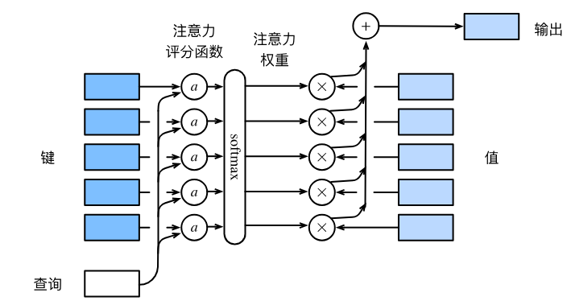

注意力评分函数（简称评分函数）是**连接查询（Query）和键（Key）、计算注意力权重的核心**，其核心逻辑的：

1. 输入：查询 `q` 和键 `k`（向量）；

2. 输出：标量（表示 `q` 和 `k` 的相似度）；

3. 后续操作：将评分函数的输出输入 `softmax`，得到注意力权重，最终通过加权和得到注意力汇聚输出。

### 数学表达（核心公式）

设查询 `q`、`n` 个“键-值对” `(k₁,v₁),...,(kₙ,vₙ)`，则：

- 注意力权重：`α = softmax(s(q, kᵢ))`（`s` 为评分函数）

- 注意力汇聚输出：`注意力汇聚(q, {(k₁,v₁),...,(kₙ,vₙ)}) = Σαᵢvᵢ`

## 二、关键辅助操作：掩蔽softmax（masked_softmax）

### 1. 核心作用

过滤无效的“键-值对”，避免无意义的词元（如文本填充词元）参与注意力汇聚，确保注意力权重仅分配给有效数据。

### 2. 实现逻辑

- 输入：3D张量 `X`（批量大小×查询数×键数）、有效长度 `valid_lens`（1D/2D，指定有效键的个数）；

- 操作：将超出有效长度的位置替换为极小值（`-1e6`），经过 `softmax` 后该位置权重趋近于0；

- 应用场景：小批量文本处理（过滤填充词元）、序列任务（过滤无效时序位置）。

### 3. 关键示例

- 1D有效长度：`masked_softmax(torch.rand(2,2,4), torch.tensor([2,3]))`，超出长度2、3的位置权重为0；

- 2D有效长度：为每个查询单独指定有效键长度，灵活适配不同样本的有效数据范围。

## 三、两种核心注意力评分函数

## （一）加性注意力（Additive Attention）

### 1. 适用场景

**查询和键的维度不同**（无法直接做点积）。

### 2. 评分函数公式

`s(q, k) = wᵥᵀ · tanh(W_q q + W_k k)`

- 可学习参数：`W_q`（查询投影矩阵）、`W_k`（键投影矩阵）、`wᵥ`（输出投影向量）；

- 核心逻辑：将 `q` 和 `k` 分别投影到同一隐藏维度，再连结（广播求和），通过 `tanh` 激活后，投影为标量评分。

### 3. 实现细节（代码核心）

- 类 `AdditiveAttention` 核心层：`W_q`（Linear，无偏置）、`W_k`（Linear，无偏置）、`w_v`（Linear，无偏置）、`Dropout`（正则化）；

- 前向传播步骤：查询/键投影 → 广播求和生成特征 → `tanh` 激活 → 标量评分 → 掩蔽softmax得权重 → 加权和输出（批量矩阵乘法 `bmm`）；

- 输入输出形状：

    - 输入：`queries`(批量, 查询数, 查询维度)、`keys`(批量, 键数, 键维度)、`values`(批量, 键数, 值维度)；

    - 输出：(批量, 查询数, 值维度)。

## （二）缩放点积注意力（Scaled Dot-Product Attention）

### 1. 适用场景

**查询和键的维度相同**（计算效率远高于加性注意力，是Transformer的核心）。

### 2. 评分函数公式

`s(q, k) = (q · k) / √d`（`d` 为查询/键的维度）

- 核心改进：除以 `√d`，解决“维度d增大时，点积方差过大、softmax输出趋于极端（要么接近1，要么接近0）”的问题；

- 批量计算公式：`注意力输出 = softmax(QKᵀ / √d) · V`（`Q`为查询矩阵，`K`为键矩阵，`V`为值矩阵）。

### 3. 实现细节（代码核心）

- 类 `DotProductAttention` 核心层：仅 `Dropout`（无额外投影层，计算更高效）；

- 前向传播步骤：计算点积 → 缩放（除以 `√d`） → 掩蔽softmax得权重 → 加权和输出（`bmm`）；

- 关键优势：无额外可学习参数，仅通过矩阵运算实现，速度快、显存占用低。

## 四、两种评分函数对比（易记表格）

|对比维度|加性注意力|缩放点积注意力|
|---|---|---|
|适用场景|查询、键维度不同|查询、键维度相同|
|可学习参数|有（W_q、W_k、w_v）|无|
|计算效率|较低（需投影+激活）|较高（仅矩阵点积+缩放）|
|核心优势|灵活性高，适配不同维度|高效简洁，适合大规模任务|

##  五、本节小结

1. 评分函数的作用：计算Q与K的相似度，为注意力权重提供依据；

2. 掩蔽softmax：过滤无效键-值对，保证注意力权重的有效性；

3. 加性注意力：适配Q、K维度不同，有可学习参数，灵活性高；

4. 缩放点积注意力：适配Q、K维度相同，无额外参数，效率高；

5. 核心逻辑：评分→softmax得权重→加权和得注意力汇聚输出。

# Bahdanau注意力模型

## 一、核心背景：为什么需要Bahdanau注意力？

### 1. 传统Seq2Seq的痛点

传统Seq2Seq（编码器-解码器）的核心问题：**每个解码步骤都使用相同的固定形状上下文变量**，无法区分输入（源）序列中对当前解码词元有用/无用的部分，导致长序列翻译等任务效果不佳。

### 2. 灵感来源

受Graves可微注意力模型（文本字符与笔迹对齐，单向对齐）启发，Bahdanau等人提出**无严格单向对齐限制**的可微注意力模型——让模型在预测每个词元时，仅“关注”输入序列中与之相关的部分，通过动态生成上下文变量解决上述痛点。

## 二、Bahdanau注意力模型核心

### 1. 核心改进

将传统Seq2Seq中“固定上下文变量”，替换为**每个解码时间步动态生成的注意力汇聚输出**，即解码时间步 `t` 的上下文变量 `c_t` 由注意力机制计算得到。

### 2. 核心公式与Q/K/V定义

设输入序列长度为 `n`，解码时间步为 `t`：

- 上下文变量（注意力汇聚输出）：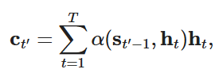
- 各组件对应关系（衔接注意力评分函数知识点）：

    1. 查询（Query）：解码器上一时间步的隐状态 `s_{t-1}`（当前解码的“意图”）；

    2. 键（Key）：编码器所有时间步的隐状态 `h_i`（输入序列的“特征标识”）；

    3. 值（Value）：编码器所有时间步的隐状态 `h_i`（与键相同，简化设计）；

    4. 评分函数：使用**加性注意力**（适配解码器隐状态与编码器隐状态可能不同维度的情况），通过 `softmax` 得到注意力权重 `α_{t,i}`，最终加权和得到 `c_t`。

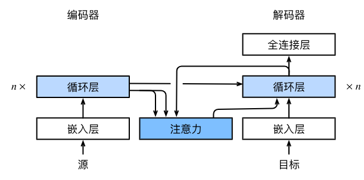

### 3. 模型架构差异

与传统Seq2Seq编码器-解码器相比，核心差异仅在**解码器**：解码器每个时间步的输入，由“上一步输出词元的嵌入 + 当前注意力汇聚输出（动态上下文变量）”共同构成，实现动态关注输入序列的相关部分。

## 三、核心实现：注意力解码器（代码关键细节）

### 1. 基础接口：AttentionDecoder

定义带有注意力机制解码器的统一接口，核心是暴露 `attention_weights` 属性（用于后续可视化注意力权重），未实现具体逻辑，供子类继承。

### 2. 具体实现：Seq2SeqAttentionDecoder（核心类）

#### （1）初始化参数

- 核心组件：加性注意力（`AdditiveAttention`）、词嵌入层（`Embedding`）、GRU解码器（`GRU`）、全连接层（`Linear`，输出词表维度）；

- 关键设计：GRU输入维度 = 词嵌入维度 + 编码器隐状态维度（因为要拼接“词嵌入 + 注意力输出”）。

#### （2）核心方法

1. `init_state`（初始化解码器状态）：

    - 输入：编码器输出（`enc_outputs`，含编码器所有时间步隐状态）、编码器有效长度（`enc_valid_lens`，过滤填充词元）；

    - 输出：调整维度后的编码器隐状态（作为注意力的K/V）、解码器初始隐状态、编码器有效长度。

2. `forward`（前向传播，核心步骤）：

① 词嵌入：将解码器输入 `X`（目标序列）转为词嵌入，调整维度适配GRU输入；

② 循环处理每个解码时间步：

- 生成查询：取解码器上一步的最终层隐状态（`hidden_state[-1]`），调整维度作为查询；

- 计算注意力：通过加性注意力，用查询匹配编码器隐状态（K/V），得到上下文变量 `context`；

- 拼接特征：将上下文变量与当前时间步的词嵌入拼接，作为GRU的输入；

- GRU前向：更新解码器隐状态，记录输出和注意力权重；

③ 全连接输出：将所有时间步的输出拼接，通过全连接层转为词表维度，返回最终输出和更新后的状态。

1. `attention_weights`（属性）：返回每个解码时间步的注意力权重，用于后续可视化。

#### （3）关键形状（便于理解代码）

- 编码器输出 `enc_outputs`：(批量大小, 输入序列长度, 编码器隐状态维度)；

- 解码器输入 `X`：(批量大小, 目标序列长度) → 词嵌入后：(目标序列长度, 批量大小, 嵌入维度)；

- 上下文变量 `context`：(批量大小, 1, 编码器隐状态维度)；

- 最终输出：(批量大小, 目标序列长度, 词表大小)。

### 3. 简单测试

用小批量数据（4个样本，每个7个时间步）测试解码器，验证输出形状符合预期，确保注意力机制和GRU解码器正常工作。

## 四、训练与验证

### 1. 训练配置

- 超参数：嵌入维度、隐状态维度、层数、 dropout（正则化）、批量大小、学习率、训练轮次；

- 数据：机器翻译数据集（英→法），加载并处理为批量迭代器；

- 模型：实例化Seq2Seq编码器、Bahdanau注意力解码器，组合为`EncoderDecoder`模型；

- 训练方法：与传统Seq2Seq一致，但因新增注意力机制，训练速度更慢。

### 2. 预测与评估

- 预测：将英语句子翻译成法语，输出翻译结果；

- 评估指标：BLEU分数（衡量翻译质量，越接近1越好），示例中多数句子BLEU=1.0，说明模型翻译效果较好。

### 3. 注意力权重可视化

- 核心结论：每个解码时间步（查询）会对输入序列的不同位置（键）分配不同的注意力权重，证明模型确实在“选择性关注”输入序列中与当前预测相关的部分（如翻译“je suis chez moi”时，会重点关注输入“i'm home”的对应词元）。

## 五、传统Seq2Seq与Bahdanau注意力Seq2Seq对比

|对比维度|传统Seq2Seq|Bahdanau注意力Seq2Seq|
|---|---|---|
|上下文变量|固定不变（全序列编码结果）|动态生成（每个解码步不同）|
|输入关注方式|无选择性（关注全序列）|选择性关注（仅相关部分）|
|核心优势|计算简单、速度快|长序列效果好、翻译更精准|
|评分函数|无注意力评分|加性注意力评分函数|

## 六、本节核心小结

1. Bahdanau注意力解决传统Seq2Seq“固定上下文变量”的痛点，实现对输入序列的选择性关注；

2. 核心逻辑：每个解码步的上下文变量 = 加性注意力汇聚输出，Q=解码器上一步隐状态，K=V=编码器所有隐状态；

3. 解码器核心：拼接“词嵌入 + 注意力输出”作为GRU输入，动态更新隐状态和注意力权重；

4. 关键验证：BLEU分数评估翻译质量，注意力权重可视化验证“选择性关注”的有效性。

# 多头注意力机制

## 一、核心背景：为什么需要多头注意力？

单一注意力头的局限性：

- 仅能学习查询（Q）、键（K）、值（V）的**一种子空间表示**，只能捕获序列中某一种依赖关系（如仅短距离/仅长距离）；

- 无法组合多种不同的注意力行为，表达能力有限。

多头注意力的目标：

让模型基于**相同的Q/K/V集合**，学习**不同子空间的表示**，并行计算多个注意力头，组合不同头的输出，从而捕获序列内**多种范围的依赖关系**（短距离+长距离、局部+全局等）。

## 二、多头注意力核心思想（重点）

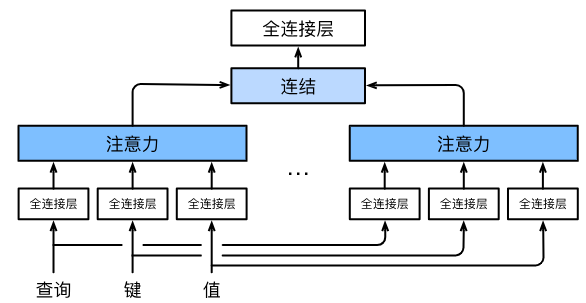

核心逻辑：“分→并→合”

1. **分**：将Q/K/V通过**多组独立的线性投影**，变换到不同的子空间（生成多组Q/K/V）；

2. **并**：每组变换后的Q/K/V并行计算一个注意力头（用缩放点积注意力）；

3. **合**：将多个头的输出拼接，再通过一次线性投影得到最终输出。

## 三、数学模型（形式化表达）

设注意力头数为  $h$ ，给定查询  $\boldsymbol{q} \in \mathbb{R}^{d_q}$ 、键  $\boldsymbol{k} \in \mathbb{R}^{d_k}$ 、值  $\boldsymbol{v} \in \mathbb{R}^{d_v}$ ：

### 1. 单个注意力头  $i$  的计算

 $\boldsymbol{o}_i = \text{Attention}(\boldsymbol{q} \boldsymbol{W}_q^{(i)}, \boldsymbol{k} \boldsymbol{W}_k^{(i)}, \boldsymbol{v} \boldsymbol{W}_v^{(i)})$ 

-  $\boldsymbol{W}_q^{(i)} \in \mathbb{R}^{d_q \times d_h}$ 、 $\boldsymbol{W}_k^{(i)} \in \mathbb{R}^{d_k \times d_h}$ 、 $\boldsymbol{W}_v^{(i)} \in \mathbb{R}^{d_v \times d_h}$ ：第  $i$  个头的可学习线性投影参数；

-  $d_h$ ：单个头的特征维度（通常设  $d_h = \frac{d_{\text{hiddens}}}{h}$ ，保证总计算量与单头一致）；

-  $\text{Attention}$ ：缩放点积注意力（优先选择，计算效率高）。

### 2. 多头注意力最终输出

 $\boldsymbol{o} = \left[\boldsymbol{o}_1, \boldsymbol{o}_2, ..., \boldsymbol{o}_h\right] \boldsymbol{W}_o$ 

-  $\left[\boldsymbol{o}_1,...,\boldsymbol{o}_h\right]$ ： $h$  个头输出的拼接（维度  $h \cdot d_h = d_{\text{hiddens}}$ ）；

-  $\boldsymbol{W}_o \in \mathbb{R}^{h \cdot d_h \times d_{\text{hiddens}}}$ ：最终的可学习线性投影参数。

## 四、实现关键：并行计算（核心代码细节）

为避免逐个计算注意力头（效率低），通过**张量转置/重塑**实现  $h$  个头的并行计算，核心依赖两个函数：

### 1. 核心函数：transpose_qkv（拆分并转置，适配并行）

#### 作用

将Q/K/V从“批量×序列长度×总隐维度”，重塑为“批量×头数×序列长度×单头隐维度”，再展平为“批量×头数 × 序列长度×单头隐维度”，让多个头在批量维度并行计算。

#### 形状变换（关键）

输入（Q/K/V）： $(batch_size, seq_len, num_hiddens)$   

→ 重塑： $(batch_size, seq_len, num_heads, num_hiddens/num_heads)$   

→ 转置： $(batch_size, num_heads, seq_len, num_hiddens/num_heads)$   

→ 展平： $(batch_size \times num_heads, seq_len, num_hiddens/num_heads)$ 

### 2. 核心函数：transpose_output（还原形状）

#### 作用

将并行计算后的多个头输出，从“批量×头数 × 序列长度×单头隐维度”还原为“批量×序列长度×总隐维度”，以便拼接后线性投影。

#### 形状变换（关键）

输入： $(batch_size \times num_heads, seq_len, num_hiddens/num_heads)$   

→ 重塑： $(batch_size, num_heads, seq_len, num_hiddens/num_heads)$   

→ 转置： $(batch_size, seq_len, num_heads, num_hiddens/num_heads)$   

→ 展平： $(batch_size, seq_len, num_hiddens)$ 

### 3. MultiHeadAttention类核心逻辑

```Python

class MultiHeadAttention(nn.Module):
    def __init__(self, key_size, query_size, value_size, num_hiddens, num_heads, dropout, bias=False):
        super().__init__()
        self.num_heads = num_heads
        self.attention = d2l.DotProductAttention(dropout)  # 缩放点积注意力
        # 4个线性层：Q/K/V的投影 + 最终拼接后的投影
        self.W_q = nn.Linear(query_size, num_hiddens, bias=bias)
        self.W_k = nn.Linear(key_size, num_hiddens, bias=bias)
        self.W_v = nn.Linear(value_size, num_hiddens, bias=bias)
        self.W_o = nn.Linear(num_hiddens, num_hiddens, bias=bias)

    def forward(self, queries, keys, values, valid_lens):
        # 1. Q/K/V线性投影 + 转置适配并行计算
        queries = transpose_qkv(self.W_q(queries), self.num_heads)
        keys = transpose_qkv(self.W_k(keys), self.num_heads)
        values = transpose_qkv(self.W_v(values), self.num_heads)
        
        # 2. 有效长度适配：每个头复用相同的有效长度
        if valid_lens is not None:
            valid_lens = torch.repeat_interleave(valid_lens, repeats=self.num_heads, dim=0)
        
        # 3. 并行计算所有头的注意力输出
        output = self.attention(queries, keys, values, valid_lens)
        
        # 4. 还原形状 + 最终线性投影
        output_concat = transpose_output(output, self.num_heads)
        return self.W_o(output_concat)
```

## 五、测试验证（关键形状）

输入输出形状验证（以示例参数为例）：

- 输入：Q=(2,4,100)、K=V=(2,6,100)，有效长度=[3,2]，头数=5，总隐维度=100；

- 单头隐维度：100/5=20；

- 并行计算时Q/K/V形状：(2×5,4,20)=(10,4,20)、(10,6,20)；

- 最终输出形状：(2,4,100)（批量×查询数×总隐维度），符合预期。

## 六、核心优势与关键设计

1. **表达能力增强**：多个头学习不同子空间的注意力模式，捕获多维度依赖；

2. **计算效率优化**：通过张量转置实现并行计算，避免逐个计算头，效率与单头接近；

3. **参数规模可控**：设  $d_{\text{hiddens}} = h \cdot d_h$ ，总参数数与单头注意力基本一致（无大幅增长）。

## 七、本节核心小结

1. 多头注意力的核心：融合多组子空间的注意力行为，捕获序列多种依赖关系；

2. 实现逻辑：Q/K/V线性投影→并行计算多注意力头→拼接→最终线性投影；

3. 并行关键：transpose_qkv/transpose_output实现张量形状变换，适配批量并行计算；

4. 注意力头选择：优先用缩放点积注意力，保证计算效率。


# 自注意力和位置编码

## 一、自注意力（核心概念）

### 1. 基本定义

自注意力也被称为**内部注意力**，是注意力机制的特殊形式：**查询（Q）、键（K）、值（V）均来自同一组输入序列**，无需外部额外的键值对。输入一个词元序列后，每个词元会作为查询，关注序列内所有词元对应的键值对，最终生成和输入长度完全相同的输出序列。

### 2. 核心逻辑与实现

从数学层面来看，给定输入词元序列，任意位置的输出都通过注意力汇聚函数计算得出，完全依托同源的Q、K、V完成加权聚合。实际代码实现中，自注意力直接基于**多头注意力**搭建，输入张量形状为（批量大小，序列长度/时间步数，隐层维度），输出张量与输入形状完全一致，保证序列编码的长度适配性。

**代码核心要点**：输入X同时充当Q、K、V传入多头注意力层，最终输出形状和输入完全匹配，这也是自注意力能直接替换RNN/CNN做序列编码的关键。

### 3. 核心优势

每个词元都能直接和序列内任意词元建立关联，彻底打破了RNN的局部依赖限制，能轻松捕捉序列内**长距离依赖关系**，同时支持完全并行计算，效率远高于逐词处理的RNN。

## 二、卷积神经网络、循环神经网络、自注意力三大架构对比

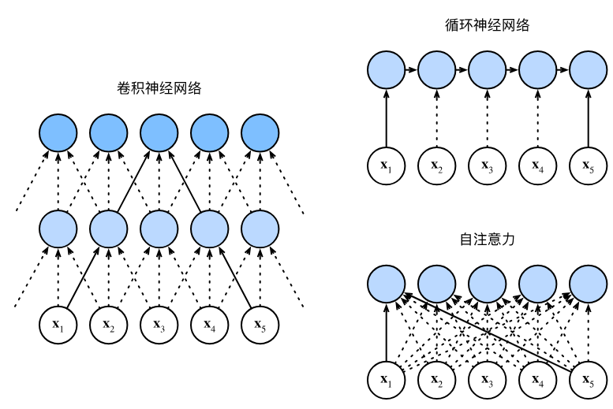

本节核心对比环节，围绕**计算复杂度、顺序操作、最大路径长度、并行能力、长距离依赖**五大维度，对比三种序列建模架构的优劣，明确各自适用场景，具体对比如下：

|对比维度|卷积神经网络（CNN）|循环神经网络（RNN）|自注意力|
|---|---|---|---|
|**计算复杂度**|O(nkd)（n=序列长度，k=卷积核大小，d=特征维度）|O(nd²)|O(n²d)（序列长度的二次方复杂度，核心缺点）|
|**顺序操作**|O(n/k)，可分层并行|O(n)，逐词处理，完全无法并行|O(1)，所有位置同步计算，完全并行|
|**最大路径长度**|O(logₖn)，多层卷积才能覆盖长序列|O(n)，长序列依赖传递路径极长|O(1)，任意位置直接相连，路径最短|
|**并行计算能力**|支持并行，效率较高|不支持并行，效率极低|完全并行，效率最高|
|**长距离依赖**|学习难度大，仅能捕捉局部依赖|学习难度极大，容易梯度消失|轻松捕捉，建模能力极强|
|**核心缺点**|长序列全局依赖建模弱|无法并行、长依赖难学|长序列计算成本极高（二次方复杂度）|

**关键结论**：CNN和自注意力都具备并行优势，自注意力的长距离依赖建模能力最强，但**序列过长时计算速度会大幅变慢**，这是自注意力最核心的局限性。

## 三、位置编码（核心补充模块）

### 1. 引入背景

RNN是逐个词元顺序处理，天生自带序列的位置顺序信息；而自注意力采用完全并行计算，所有词元同时参与运算，**完全丢失了词元的先后顺序信息**。但序列任务（如文本、语音）中，词元顺序直接决定语义，因此需要通过**位置编码**，向输入表示中注入位置信息，弥补这一缺陷。

### 2. 基本定义

位置编码是向输入词嵌入中叠加额外的位置特征，为模型提供**绝对位置信息**（词元在序列中的具体位置）和**相对位置信息**（词元之间的距离关系）。位置编码分为可学习型和固定型，本节采用Transformer原生的**正弦余弦固定位置编码**，无需训练，直接通过三角函数生成。

### 3. 核心公式与实现

位置编码通过位置嵌入矩阵实现，矩阵的行对应词元在序列中的位置，列对应编码维度，核心规则为：

- **偶数维度**：采用正弦函数（sin）计算

- **奇数维度**：采用余弦函数（cos）计算

代码实现通过**PositionalEncoding**类完成：先创建足够长的位置矩阵，前向传播时将位置编码直接叠加到输入词嵌入上，再通过Dropout做正则化，保证位置信息稳定注入。

### 4. 核心特性

- **捕获绝对位置**：不同位置的编码值不同，编码维度上的频率沿维度方向单调递减，连续浮点数表示比二进制更节省空间，能清晰区分每个词元的绝对位置。

- **捕获相对位置**：对于任意固定的位置偏移，某一位置的编码可通过线性投影得到另一位置的编码，模型能自主学习词元之间的相对位置关系，不依赖具体位置索引。

## 四、本节核心小结

1. 自注意力的核心是**Q、K、V同源**，均来自输入序列本身，也叫内部注意力，输出与输入等长。

2. 自注意力并行能力最强、长距离依赖建模最优，但计算复杂度是序列长度的二次方，长序列运行速度慢。

3. RNN自带顺序信息但无法并行，CNN可并行但长依赖弱，自注意力需额外补充位置信息。

4. 位置编码的作用是向并行计算的自注意力注入**绝对+相对位置信息**，Transformer常用正弦余弦固定编码实现。

## 五、关键注意事项

1. 自注意力不可单独直接用于序列任务，必须搭配位置编码，否则模型无法识别词元先后顺序，任务效果会大幅下降。

2. 长序列任务中，自注意力的二次方复杂度是核心瓶颈，后续Transformer变体多针对这一点做优化。

3. 位置编码直接叠加在输入嵌入上，不改变输入输出形状，不影响原有注意力机制的计算流程。

# transformer

## 一、核心定位与设计优势

1. **核心特点**：无卷积/循环层，完全基于注意力机制，同时具备**极致并行性**（自注意力替代 RNN 逐词处理）和**短路径长度**（任意词元直接关联），解决了 RNN 长依赖难学、CNN 全局依赖弱的问题。

2. **适用场景**：最初用于序列到序列（Seq2Seq）任务（如机器翻译），现扩展到 NLP/视觉/语音等领域，编码器/解码器可单独使用（如 BERT 用编码器，GPT 用解码器）。

3. **对比 Bahdanau 注意力 Seq2Seq**：后者仍依赖 RNN 做编解码，仅在解码器引入注意力；Transformer 则用“多头自注意力+位置编码”完全替代 RNN，并行效率更高。

## 二、Transformer 整体架构

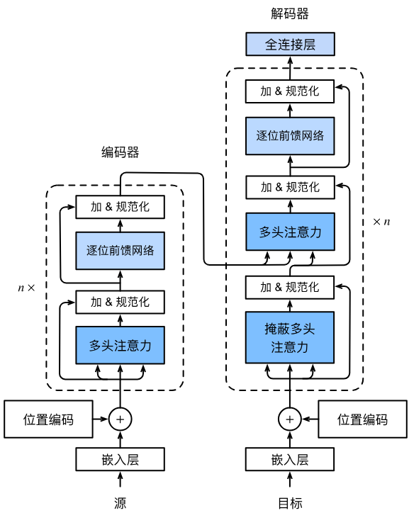

Transformer 遵循**编码器-解码器**架构，核心是“层堆叠+残差连接+层规范化”：

- **编码器**：由 `num_layers` 个相同的编码器块堆叠而成，输入为源序列嵌入+位置编码，输出为源序列的全局表示；

- **解码器**：由 `num_layers` 个相同的解码器块堆叠而成，输入为目标序列嵌入+位置编码，结合编码器输出完成预测，通过**掩蔽注意力**保证自回归属性；

- **统一约束**：所有组件的特征维度均为 `num_hiddens`，确保残差连接的加法操作和注意力的点积计算维度匹配。

## 三、核心组件详解

### 1. 基于位置的前馈网络（PositionWiseFFN）

- **核心逻辑**：对序列中**每个位置的词元表示**，用**同一个两层 MLP** 做变换（输入→隐藏层→ReLU→输出层）；

- **形状变换**：输入 `(batch_size, seq_len, num_hiddens)` → 输出 `(batch_size, seq_len, num_hiddens)`，仅改变最后一维的内部特征，不改变序列长度；

- **作用**：对注意力输出的特征做非线性变换，增强模型表达能力。

### 2. 残差连接 + 层规范化（AddNorm）

- **层规范化 vs 批量规范化**：

    - 批量规范化：按**样本维度**归一化（适合视觉）；

    - 层规范化：按**特征维度**归一化（适合变长序列的 NLP 任务）；

- **AddNorm 逻辑**：`ln(X + dropout(Y))`，其中 X 是子层输入，Y 是子层输出；

- **核心作用**：解决深度模型的梯度消失问题，保证模型可训练（Transformer 层数通常≥6）。

### 3. 多头注意力的三类应用

|注意力类型|应用位置|查询（Q）来源|键（K）/值（V）来源|特殊约束|
|---|---|---|---|---|
|编码器自注意力|编码器块|前一层编码器输出|前一层编码器输出|基于有效长度屏蔽填充词元|
|解码器掩蔽自注意力|解码器块（第一层）|前一层解码器输出|前一层解码器输出|掩蔽未来位置（自回归）|
|编码器-解码器注意力|解码器块（第二层）|解码器自注意力输出|编码器最终输出|基于编码器有效长度屏蔽填充词元|

## 四、编码器设计（TransformerEncoder）

### 1. 单编码器块（EncoderBlock）

- **子层结构**：多头自注意力 → AddNorm → 基于位置的前馈网络 → AddNorm；

- **输入输出**：形状始终为 `(batch_size, seq_len, num_hiddens)`，不改变序列长度；

- **关键处理**：自注意力阶段传入`valid_lens`，避免查询与填充词元计算注意力。

### 2. 编码器整体流程

1. **输入处理**：词嵌入（`Embedding`）→ 缩放（×√num_hiddens）→ 叠加位置编码（`PositionalEncoding`）；

    - 缩放原因：位置编码值在[-1,1]，嵌入值缩放后量级匹配，避免位置编码被掩盖；

2. **层堆叠**：依次经过 `num_layers` 个编码器块，每个块输出都通过 AddNorm 保留残差信息；

3. **输出**：源序列的全局特征表示，供解码器使用。

## 五、解码器设计（TransformerDecoder）

### 1. 单解码器块（DecoderBlock）

- **子层结构**：掩蔽自注意力 → AddNorm → 编码器-解码器注意力 → AddNorm → 前馈网络 → AddNorm；

- **自回归约束**：训练时生成`dec_valid_lens`（每行是[1,2,...,seq_len]），确保查询仅关注当前及之前位置；预测时逐词生成，动态拼接已生成词元的特征。

### 2. 解码器整体流程

1. **输入处理**：与编码器一致（词嵌入+缩放+位置编码）；

2. **状态初始化**：传入编码器输出、编码器有效长度、空列表（存储已生成词元特征）；

3. **层堆叠**：依次经过 `num_layers` 个解码器块，最终通过全连接层映射到目标词表维度；

4. **注意力权重存储**：记录解码器自注意力和编码器-解码器注意力权重，用于可视化。

## 六、训练与应用

### 1. 训练关键

- **数据集**：以英-法机器翻译为例，输入为源序列（英语）、目标序列（法语）；

- **优化器**：Adam（学习率 0.005），搭配 Dropout 正则化；

- **评估指标**：BLEU 分数（越接近 1 翻译效果越好）。

### 2. 注意力可视化

- **编码器自注意力**：查询/键均来自源序列，可观察源序列内部的词元关联（如“i'm home”中“home”与“i'm”的注意力权重）；

- **解码器自注意力**：掩蔽未来位置，权重矩阵下三角非零，上三角为0；

- **编码器-解码器注意力**：可观察目标词元对源词元的关注（如法语“chez moi”关注英语“home”）。

## 七、核心小结

1. Transformer 是纯注意力的编解码架构，无 CNN/RNN，依赖多头注意力+位置编码实现序列建模；

2. 编码器用自注意力建模源序列内部依赖，解码器用“掩蔽自注意力+编码器-解码器注意力”实现自回归预测；

3. 残差连接+层规范化是训练深层 Transformer 的核心，基于位置的前馈网络增强特征表达；

4. 位置编码解决自注意力的顺序丢失问题，缩放嵌入值保证位置编码的有效性；

5. 掩蔽注意力是解码器自回归的关键，确保预测仅依赖已生成词元。

## 八、关键易错点

1. **位置编码叠加方式**：直接相加（X + Pos），而非拼接，保证特征维度不变；

2. **有效长度的两类应用**：编码器屏蔽填充词元，解码器掩蔽未来位置；

3. **词嵌入缩放**：必须×√num_hiddens，否则位置编码的作用会被嵌入值掩盖；

4. **解码器状态管理**：预测阶段需动态拼接已生成词元的特征，而非一次性输入全部目标序列。