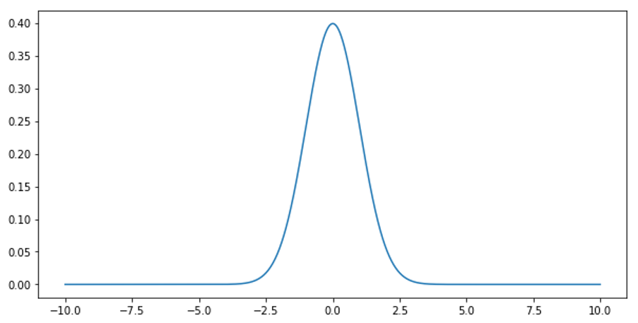

# 2.概率统计

> 内容速览：
> 
> - 2.1 基础概率
>     - 随机变量, 条件概率, 贝叶斯法则
> - 2.2 朴素贝叶斯
>     - 多项测试
> - 2.3 采样
>     - 中心极限定理
>     - 分布（分类变量, 正态分布, 均匀分布）

## 2.1 基础概率

### 随机变量

随机变量是一个函数，它将样本空间中的每个结果映射到一个实数。随机变量可以是离散的（取有限或可数无限个值）或连续的（取无限多个值）。

### 条件概率

条件概率是指在事件B发生的条件下，事件A发生的概率，记作P(A|B)。计算公式为：
$P(A|B) = P(A ∩ B) / P(B)$，其中P(A ∩ B)表示事件A和事件B同时发生的概率。

### 贝叶斯法则

贝叶斯法则描述了如何根据新的证据更新事件的概率。公式为：
$P(A|B) = \frac{P(B|A) \cdot P(A)}{P(B)}$，其中P(B|A)是事件A发生时事件B发生的概率，P(A)是事件A的先验概率，P(B)是事件B的总概率。

## 2.2 朴素贝叶斯

朴素贝叶斯是一种基于贝叶斯定理的分类算法，假设特征之间相互独立。它通过计算每个类别的后验概率来进行分类，选择具有最高后验概率的类别作为预测结果。

### 多项测试

多项测试是指在朴素贝叶斯分类器中，处理多类别分类问题的一种方法。它假设每个类别的特征分布服从多项分布，通过计算每个类别的概率来进行分类。

**e.g.** 在文本分类中，朴素贝叶斯可以用于垃圾邮件检测，通过计算邮件中各个词汇在垃圾邮件和非垃圾邮件中的出现概率，来判断一封邮件是否为垃圾邮件。

## 2.3 采样

### 中心极限定理

中心极限定理指出，对于一个具有有限均值和方差的独立同分布随机变量序列，当样本容量足够大时，其样本均值的分布将近似服从正态分布，无论原始变量的分布形态如何。

### 分布

#### 分类变量

分类变量是指取有限个类别值的变量，例如性别（男、女）、颜色（红、蓝、绿）等。分类变量通常用于描述离散的属性。

#### 正态分布
正态分布（也称为高斯分布）是一种连续概率分布，其概率密度函数呈钟形曲线。正态分布由两个参数决定：均值（μ）和标准差（σ）。其概率密度函数为：
$f(x) = \frac{1}{\sigma \sqrt{2\pi}} e^{-\frac{(x - \mu)^2}{2\sigma^2}}$

平均差值μ决定了分布的中心位置，标准差σ决定了分布的宽度。大多数自然现象（如身高、体重等）都近似服从正态分布。
#### 均匀分布
均匀分布是一种概率分布，其中所有结果在一个特定区间内具有相同的概率。对于连续均匀分布，概率密度函数为：
$f(x) = \frac{1}{b - a}$，其中a和b是区间的下限和上限。

#### 离散分布
离散分布是指随机变量只能取有限或可数无限个值的概率分布。例如，掷骰子的结果就是一个离散分布，可能的结果为1到6。

#### 指数分布
指数分布是一种连续概率分布，常用于描述事件发生的时间间隔。其概率密度函数为：
$f(x; \lambda) = \lambda e^{-\lambda x}$，其中λ是分布的参数，表示事件发生的速率。

