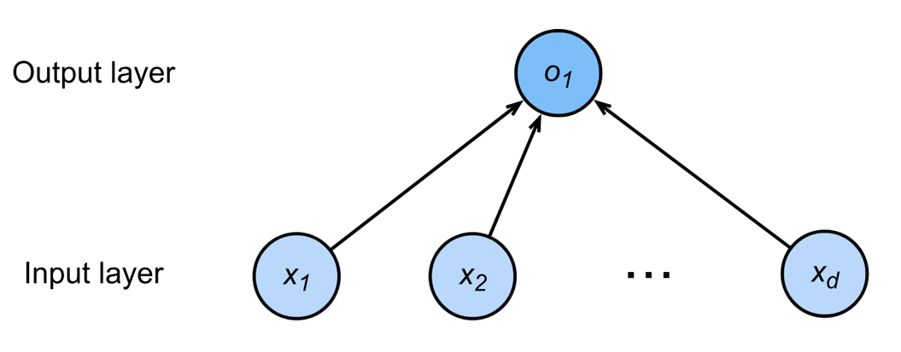
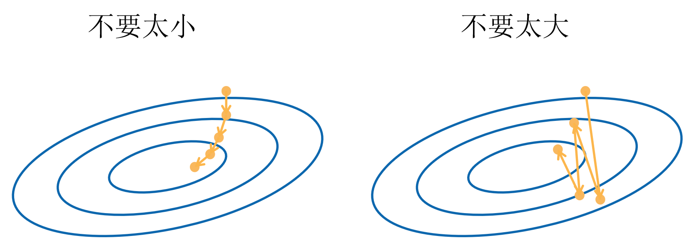
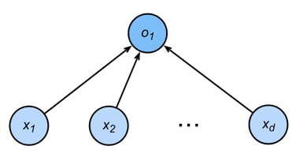
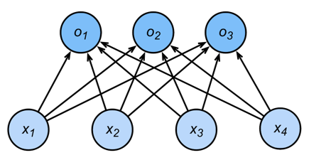

# 4.线性方法、基础优化和 softmax 回归

> 内容速览：
> 
> - 线性方法
>      - 神经科学的灵感
> - 基础优化
> - softmax 回归
>      - 回归与分类
>      - Kaggle上的分类任务

## 4.1 线性方法
给予n维输入，线性方法通过计算输入与权重向量w的点积并加上偏置b来进行预测：
\(
\hat{y} = w^T x + b
\)
其中，$w$是权重向量，$x$是输入向量，$b$是偏置项，$\hat{y}$是模型的预测输出。

线性方法的目标是找到一组最优的权重和偏置，使得预测输出尽可能接近真实标签。常用的损失函数包括均方误差（MSE）和交叉熵损失。

### **损失函数**
损失函数用于衡量模型预测与真实标签之间的差距。对于回归任务，常用的损失函数是均方误差（MSE）：
\(L(w,b) = \frac{1}{m} \sum_{i=1}^{m} (\hat{y}^{(i)} - y^{(i)})^2\)
其中，$m$是样本数量，$\hat{y}^{(i)}$是第$i$个样本的预测值，$y^{(i)}$是真实标签。

## 4.2 基础优化
基础优化方法主要包括梯度下降（Gradient Descent）及其变种，如随机梯度下降（SGD）和小批量梯度下降（Mini-batch GD）。这些方法通过计算损失函数相对于模型参数的梯度，逐步调整参数以最小化损失。

### **梯度下降**
梯度下降的更新规则为：
\(
w = w - \eta \nabla_w L(w,b)
\)
其中，$\eta$是学习率，$\nabla_w L(w,b)$是损失函数$L(w,b)$对权重$w$的梯度。

### **学习率**

学习率决定了每次参数更新的步长。选择合适的学习率对于模型的收敛速度和最终性能至关重要。过大的学习率可能导致发散，过小的学习率则可能导致收敛缓慢。

### **小批量梯度下降**
小批量梯度下降结合了批量梯度下降和随机梯度下降的优点，通过在每个迭代步骤中使用小批量样本计算梯度，能够更快地收敛并避免局部最优解。

步骤如下：
1.选择一个起点
2.重复
    - 计算梯度
    - 更新参数

## 4.3 softmax 回归
softmax 回归是一种用于多分类任务的线性模型。它通过将线性组合的输出转换为概率分布来进行分类。

### **回归与分类**

对于多分类任务，softmax 回归通过计算每个类别的得分，并使用 softmax 函数将这些得分转换为概率：
\(
P(y=j|x) = \frac{e^{w_j^T x + b_j}}{\sum_{k=1}^{K} e^{w_k^T x + b_k}}
\)
其中，$K$是类别数量，$w_j$和$b_j$分别是类别$j$的权重和偏置。

**<u>回归估计连续值，分类估计离散类别。</u>**

### 从回归到分类

1、单个连续数值输出

2、输出每个类别的置信度

### softmax 函数
softmax 函数将线性输出转换为概率分布，确保所有类别的概率之和为1：
\(\sigma(z)_j = \frac{e^{z_j}}{\sum_{k=1}^{K} e^{z_k}}\)
其中，$z_j$是类别$j$的线性输出。

### 损失函数
softmax 回归通常使用交叉熵损失函数来衡量预测概率与真实标签之间的差距：
\(L(w,b) = -\frac{1}{m} \sum_{i=1}^{m} \sum_{j=1}^{K} y_j^{(i)} \log(P(y=j|x^{(i)}))\)
其中，$y_j^{(i)}$是第$i$个样本的真实标签的独热编码。

### **softmax 梯度**
softmax 函数的梯度计算较为复杂，但可以通过链式法则进行推导。对于类别$j$，梯度为：
\(\frac{\partial L}{\partial w_j} = \frac{1}{m} \sum_{i=1}^{m} (P(y=j|x^{(i)}) - y_j^{(i)}) x^{(i)}\)

\(\frac{\partial L}{\partial b_j} = \frac{1}{m} \sum_{i=1}^{m} (P(y=j|x^{(i)}) - y_j^{(i)})\)
其中，$m$是样本数量。

### 线性回归vs softmax 回归
| 特性               | 线性回归                     | softmax 回归                 |
|-------------------|------------------------------|------------------------------|
| 输出类型          | 连续值                       | 概率分布                     |
| 损失函数          | MSE                          | 交叉熵损失                   |
| 应用场景          | 回归任务                     | 多分类任务                   |
|模型              |$<w,x>+b$                      | $softmax(<w,x>+b)$            |

