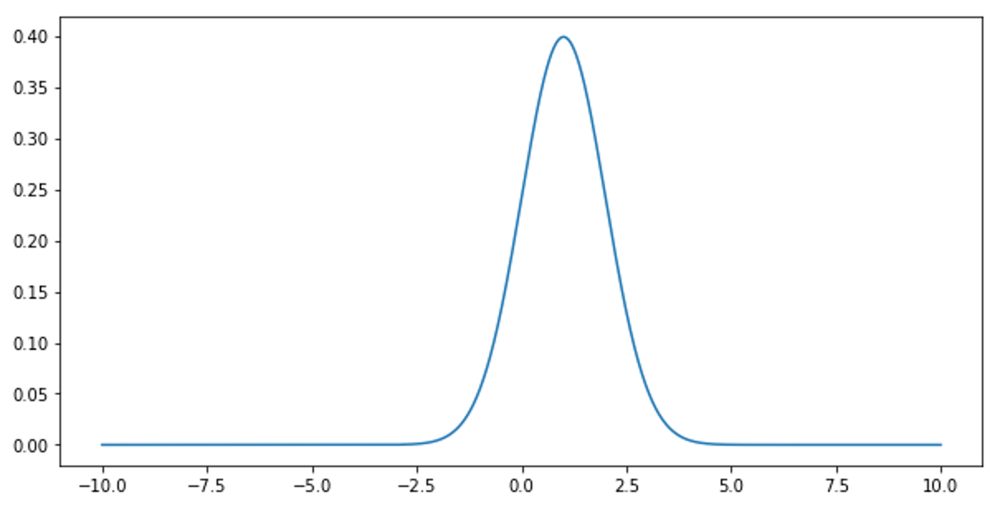
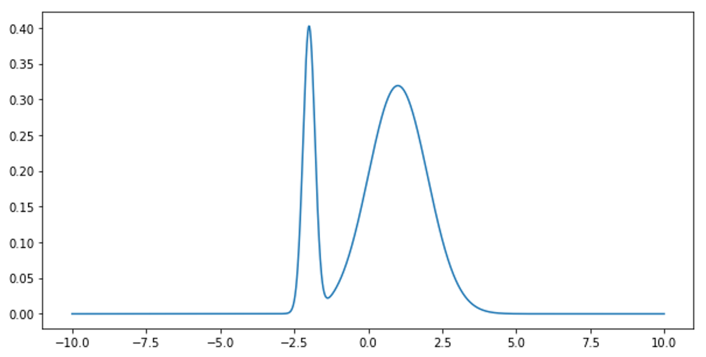
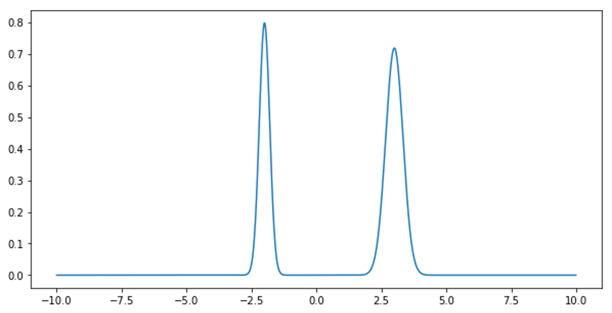
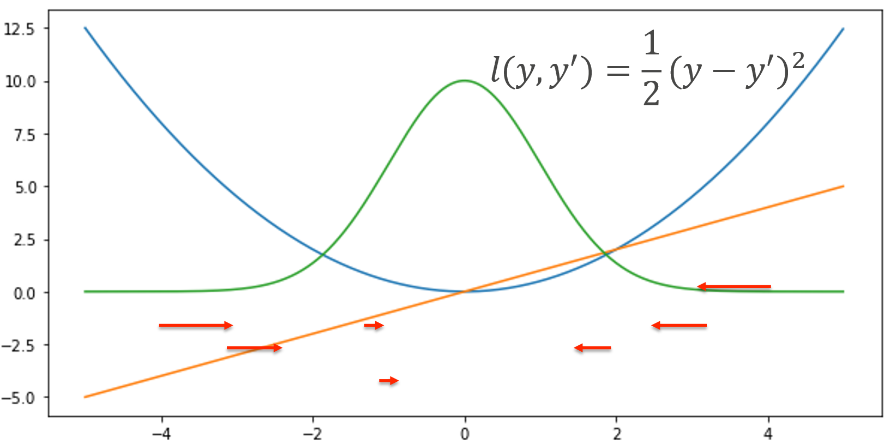
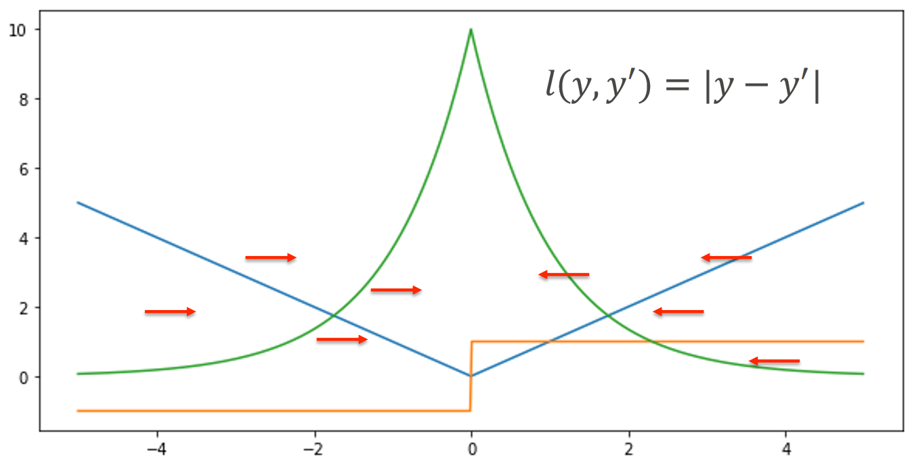
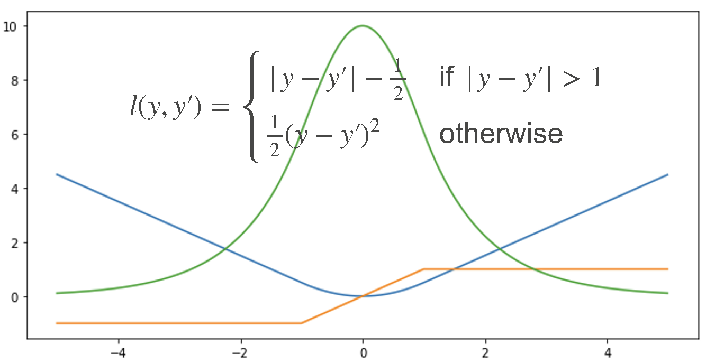

# 5.最大似然估计 和 逻辑回归

> 内容概述:
> 
> - 最大似然估计 
> - 损失函数
>       - l_2 损失 
>       - l_1 损失
>       - Huber 损失

## 5.1最大似然估计

最大似然估计（Maximum Likelihood Estimation, MLE）是一种用于估计统计模型参数的方法。其基本思想是通过选择使得观测数据出现的概率最大的参数值来进行估计。

假设我们有一个参数为 θ 的概率模型，观测数据为 $D = {x_1, x_2, ..., x_n}$。最大似然估计的目标是找到参数 θ，使得在给定参数 θ 的情况下，观测数据 D 出现的概率（即似然函数）最大化。

数学上，似然函数 L(θ) 定义为观测数据在参数 θ 下的联合概率：
$L(θ) = P(D | θ) = P(x_1, x_2, ..., x_n | θ)$

为了简化计算，通常使用对数似然函数：
$log L(θ) = log P(D | θ) = log P(x_1, x_2, ..., x_n | θ)$

最大似然估计的目标是找到参数 θ，使得对数似然函数最大化：
$θ_{MLE} = argmax_θ log L(θ)$

在实际应用中，最大似然估计常用于各种统计模型的参数估计，如线性回归、逻辑回归等。通过最大化似然函数，我们可以得到最符合观测数据的参数估计值，从而提高模型的预测能力。

## 5.2 损失函数

### 平方损失（L2损失）

### 绝对值损失（L1损失）

### Huber损失

