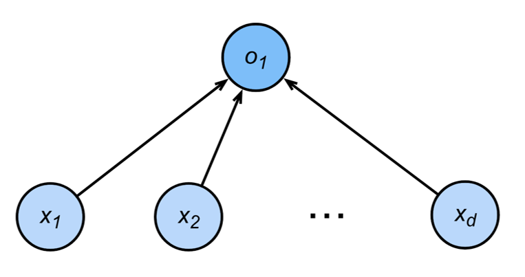
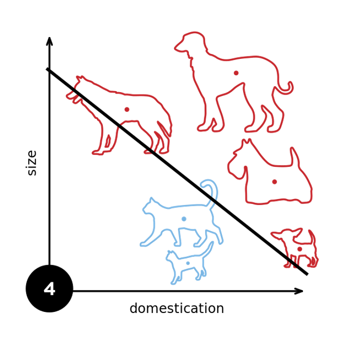
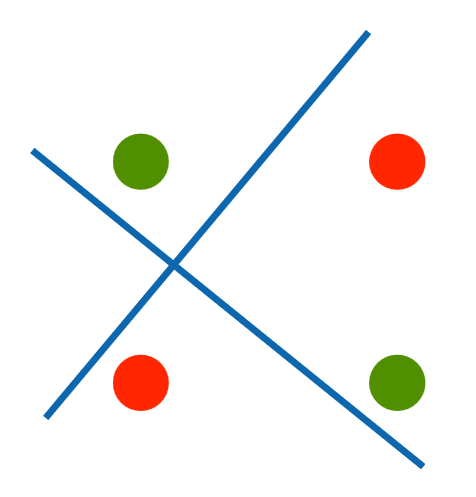
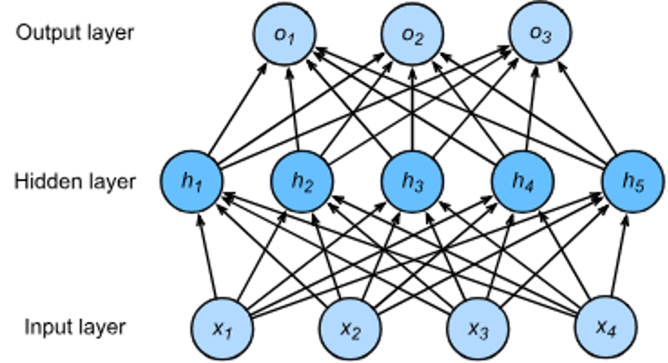
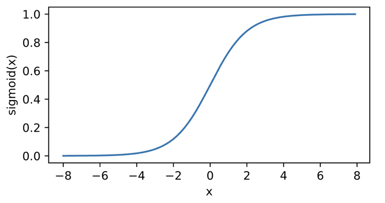
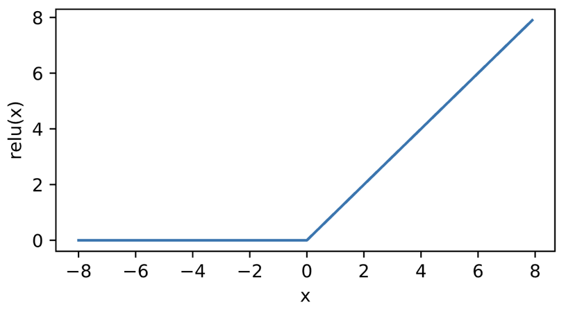
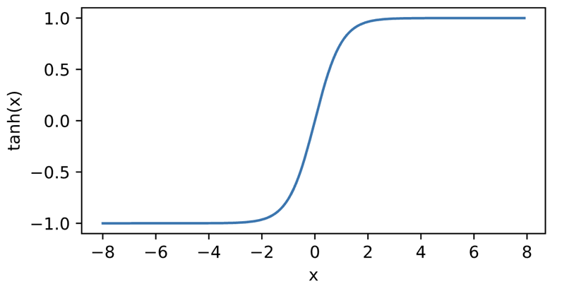
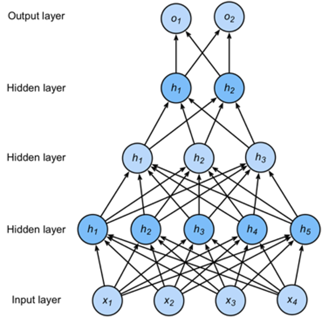

# 6. 多层感知机

> 内容概述:
>
> - 单层感知机:
>       - 决策边界
>       - XOR问题
> - 多层感知机:
>       - 层数
>       - 非线性
>       - 计算成本

## 6.1 单层感知机
给予输入 x， 权重 w 和偏差 b；感知机输出：
$y = f(w·x + b)$， 其中 f 是激活函数。

### 6.1.1决策边界
决策边界是指在输入空间中将不同类别的数据点分隔开的边界。在单层感知机中，决策边界是一个超平面，可以用以下方程表示：
$w·x + b = 0$
其中 w 是权重向量，x 是输入向量，b 是偏差项。决策边界将输入空间分为两部分，一部分对应于输出为 1 的类别，另一部分对应于输出为 0 的类别。

### 6.1.2XOR问题
XOR问题是指在输入空间中，存在一个无法用单层感知机的线性决策边界来分隔的分类问题。具体来说，XOR问题涉及到两个输入变量 x1 和 x2，以及一个输出变量 y。对于 XOR 问题，当 x1 和 x2 的值相同时（即 (0,0) 和 (1,1)），输出 y 为 0；当 x1 和 x2 的值不同时（即 (0,1) 和 (1,0)），输出 y 为 1。由于 XOR 问题的决策边界是非线性的，因此单层感知机无法解决这个问题。

## 6.2 多层感知机

多层感知机（Multilayer Perceptron, MLP）是一种前馈神经网络，由多个层次的神经元组成。每个层次的神经元与前一层的神经元进行连接，并通过激活函数进行非线性变换。多层感知机的结构通常包括输入层、一个或多个隐藏层以及输出层。每个隐藏层的神经元数量和激活函数的选择可以根据具体问题进行调整。

多层感知机的引入使得神经网络能够学习和表示更复杂的函数关系，从而解决单层感知机无法处理的非线性问题，如XOR问题。然而，多层感知机的训练过程相对复杂，需要使用反向传播算法来更新权重和偏差，以最小化损失函数。此外，随着层数的增加，计算成本也会显著增加，因此在设计多层感知机时需要权衡模型的复杂度和计算资源的限制。

### 6.2.1**单隐藏层感知机**

输入层 -> 隐藏层 -> 输出层

- 输入： $x∈R^n$
- 隐藏层： $h = f(Wx + b)$， $W∈R^{m×n}$， $b∈R^m$
- 输出层： $y = g(Vh + c)$， $V∈R^{k×m}$， $c∈R^k$

### 6.2.2 激活函数

激活函数（Activation Function）是神经网络中用于引入非线性变换的函数。它将神经元的输入映射到输出，使得神经网络能够学习和表示复杂的函数关系。常用的激活函数包括 sigmoid 函数、ReLU 函数、tanh 函数等。

**Sigmoid 函数**
$σ(x) = \frac{1}{1 + e^{-x}}$

**ReLU 函数（线性修正函数）**
$ReLU(x) = max(0, x)$

**tanh 函数（双曲正切函数）**
$tanh(x) = \frac{e^x - e^{-x}}{e^x + e^{-x}}$

### 6.2.3 多类别分类

对于多类别分类问题，输出层通常使用 softmax 激活函数，将输出转换为概率分布。softmax 函数定义如下：
$softmax(z_i) = \frac{e^{z_i}}{\sum_{j=1}^k e^{z_j}}$

$y_1,y_2,...,y_k=softmax(o_1,o_2,...,o_k)$
其中 $o_i$ 是输出层的第 i 个神经元的输入，$y_i$ 是输出层的第 i 个神经元的输出，$y_1,y_2,...,y_k$ 是输出层的 k 个神经元的输出，softmax 函数将它们转换为一个概率分布，使得每个类别的概率值在 0 到 1 之间，并且所有类别的概率值之和为 1。这使得多层感知机能够处理多类别分类问题。

### 6.2.4 **多隐藏层感知机**

$h_1 = f(W_1x + b_1)$

$h_2 = f(W_2h_1 + b_2)$

$h_3 = f(W_3h_2 + b_3)$

$y = g(W_4h_3 + c)$

超参数（Hyperparameters）是指在训练神经网络时需要手动设置的参数，而不是通过训练过程自动学习得到的参数。超参数的选择对神经网络的性能和训练速度有重要影响。常见的超参数包括：

- 隐藏层数量
- 每个隐藏层的神经元数量