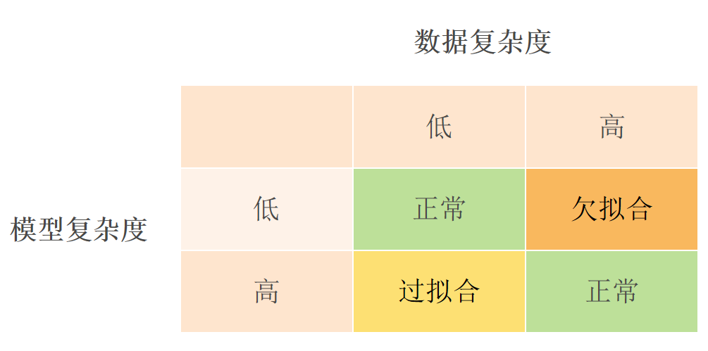
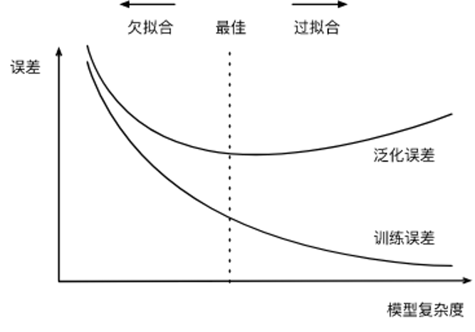
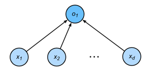
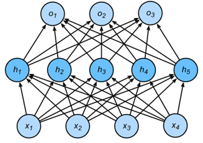
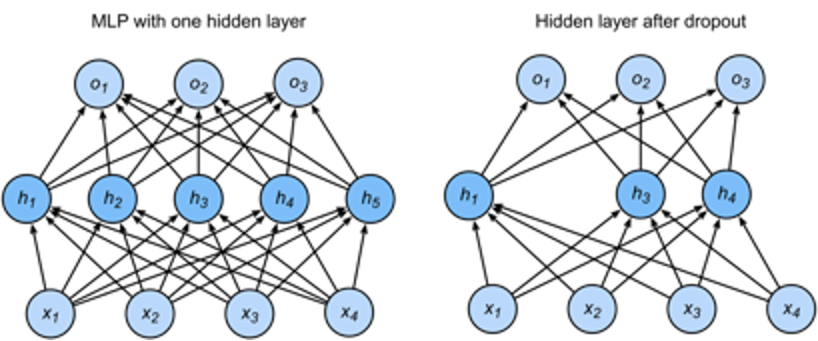

# 7.模型选择，欠拟合与过拟合，权重衰减 和 丢弃法

> 内容概述：
> 
> - 模型选择
>       - 训练误差和泛化误差
>       - K 折交叉验证
> - 欠拟合与过拟合
>       - 模型复杂度
>       - VC 维度
> - 权重衰减
> - 丢弃法

## 7.1模型选择

### 7.1.1训练误差和泛化误差

- 训练误差：出自于训练数据
- 泛化误差：出自于新数据
- 示例：使用历年考试真题准备将来的考试：在历年考试真题取得好成绩（训练误差）并不能保证未来考试成绩好（泛化误差），学生 A 通过死记硬背学习在历年考试真题取得0错误，学生 B 理解并给出答案的解释，学生 B 的泛化误差可能会高一些。

### 7.1.2 验证数据集和测试数据集

- 验证数据集：用于评估模型的数据集
例如：取出50％的训练数据、不应与训练数据混在一起（＃1 常见错误）
- 测试数据集：只可以使用一次数据集，例如未来的考试、我买的房子售价、Kaggle的私人排行榜中使用的数据集

### 7.1.2 K 折交叉验证

在没有足够的数据时非常有用

**算法**:

- 将训练数据划分为 K 个部分
- 对于 i = 1，...，K
- 使用第 i 部分作为验证集，其余部分用于训练
- 报告 K 个部分在验证时的平均错误

常见 K 值选择：5 - 10

## 7.2欠拟合与过拟合

- 欠拟合：模型过于简单，无法捕捉数据中的模式
- 过拟合：模型过于复杂，捕捉了数据中的噪声和异常值

### 7.2.1 模型复杂度

- 模型复杂度：模型能够拟合数据的能力
- 复杂度过低：欠拟合
- 复杂度过高：过拟合

**估计模型复杂度的方法**:

复杂度：d+1

复杂度：(d+1)m+(m+1)k

很难比较不同算法之间的复杂度：树的深度、神经网络的层数和每层的神经元数量等
给定算法族，两个主要因素很重要：参数个数、每个参数采用的值

### 7.2.2 VC 维度

VC 维度：衡量模型复杂度的标准

对于分类模型，<u>VC维度等于这个数据集的大小</u>，无论我们如何分配标签，都存在一个模型来完美地对它进行分类.

## 7.3 权重衰减

通过限制参数值范围来降低模型复杂性\( \min_{w,b}\ \ell(w,b) \quad \text{subject to} \quad \|w\|^2 \leq \theta \)

- 通常不限制偏差参数 b
- 做或不做在实践中几乎没有区别
- 小 θ 意味着更多的正则化

### 平方正则化作为软约束

对于每一个 θ，我们都可以找到 λ 将硬约束版本重写为\( \min_{w,b}\ \ell(w,b) + \lambda/2 \|w\|^2 \)

参数 λ 控制正则化的重要性:

- λ=0： 没有效果
- λ→∞： 强烈正则化，所有权重都趋向于0

### 更新规则

- 计算梯度

在t时刻，权重更新为：
$\begin{aligned}\frac{\partial}{\partial w} \left( \ell(w,b) + \frac{\lambda}{2} \|w\|^2 \right) = \frac{\partial \ell(w,b)}{\partial w} + \lambda w\end{aligned}$

- 更新权重
$\begin{aligned}w \leftarrow w - \alpha \left( \frac{\partial \ell(w,b)}{\partial w} + \lambda w \right) = (1 - \alpha \lambda) w - \alpha \frac{\partial \ell(w,b)}{\partial w}\end{aligned}$

通常 λ 很小，所以权重衰减项 (1 - α λ) 接近于 1

> 权重衰减的效果：每次迭代都会将权重乘以一个小于 1 的数，从而逐渐减小权重的值。这有助于防止过拟合，因为它限制了模型的复杂度，防止模型记住训练数据中的噪声和异常值。

## 7.4暂退法
在输入的适度变化下，一个好的模型应该是稳定的，用输入噪声训练相当于 Tikhonov 正则化，<u>丢弃法：将噪音注入内部隐藏层，每次训练迭代时，随机丢弃一部分隐藏层的输出</u>。

### 添加没有偏差的噪声

1.将噪声添加到 x 中以获得 x‘：
$\begin{aligned}x' = x + \epsilon\end{aligned}$

- 例如：ε ~ N(0, σ^2 I)，其中 I 是单位矩阵

噪声的引入不会改变输入的期望
$\begin{aligned}E[x'] = E[x + \epsilon] = E[x] + E[\epsilon] = x\end{aligned}$

2.丢弃法将噪声添加到每一个元素 x_i 中：
$\begin{aligned}x_i' = \begin{cases} 0 & \text{with probability } p \\ x_i/(1-p) & \text{otherwise} \end{cases}\end{aligned}$

### 丢弃法的训练

- 每次训练迭代时，随机丢弃一部分隐藏层的输出
- 例如：丢弃率 p=0.5，意味着每个隐藏层输出有 50% 的概率被丢弃

$h=\sigma(Wx+b)$

$\tilde{h}=dropout(h)$

$o=\sigma(W'\tilde{h}+b')$

$y=softmax(o)$

### 丢弃法的推断

正规化仅用于模型训练

丢弃法在推断中用于：$h^′=dropout(h)$

保证确定性结果：在推断时，每个隐藏层的输出都被归一化，以确保模型的输出是确定的，而不是随机的。

