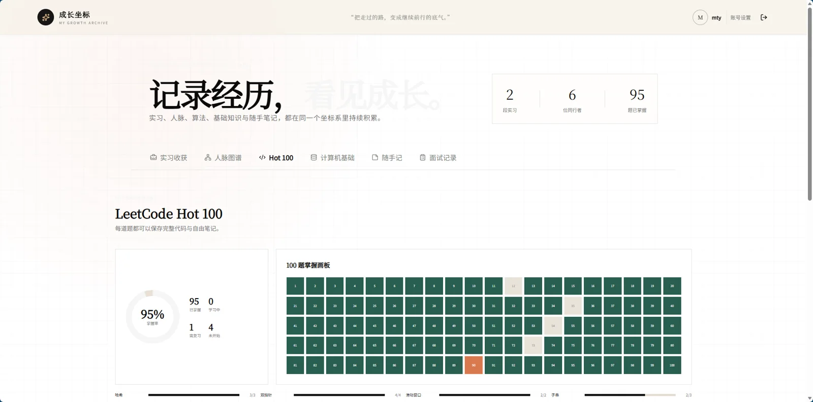
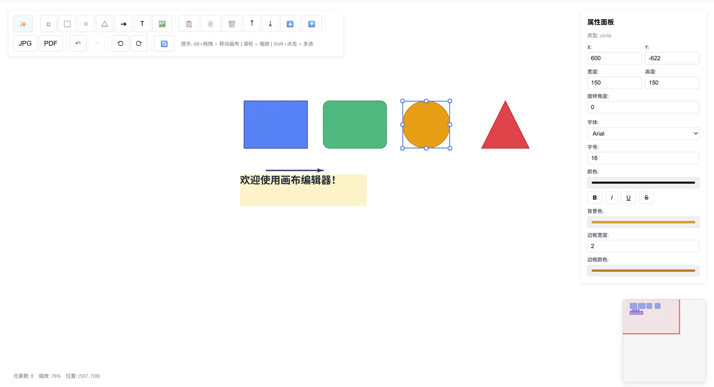
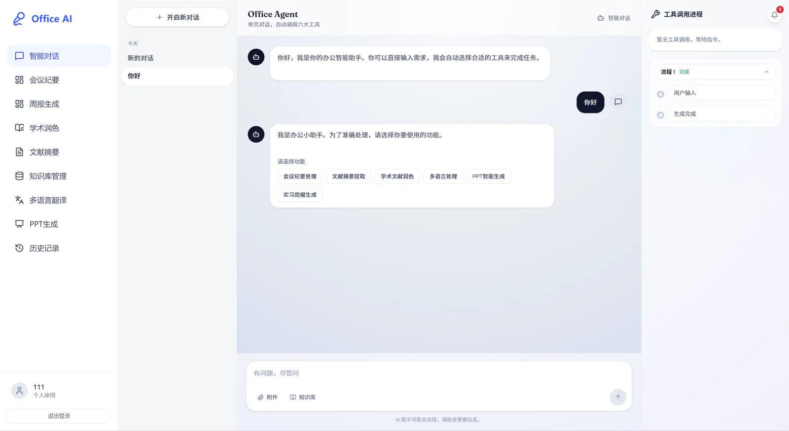
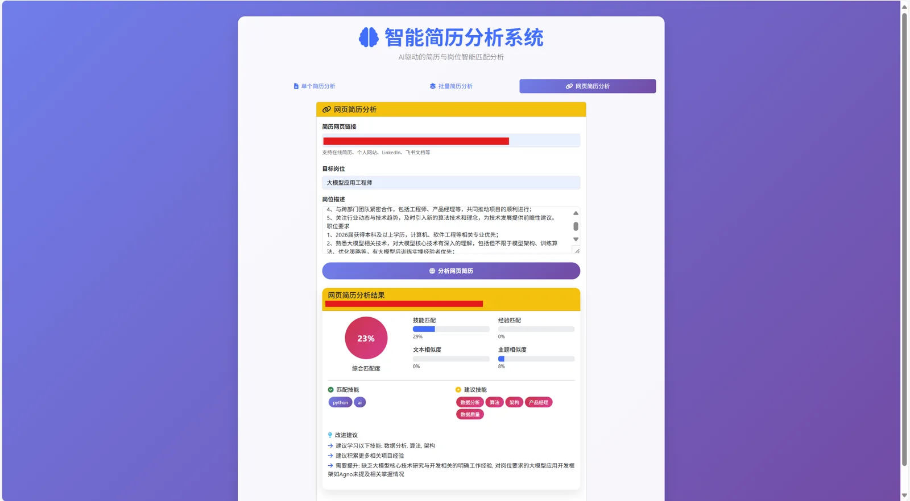

<section class="blog-hero" markdown="1">

MU-TY / DIGITAL GARDEN

# 把好奇心， 写成代码。

你好，我是 MU-ty。这里收集我的算法题解、深度学习笔记与编程实践。把问题拆开，把原理想清楚，再把知识一点点连起来。

[开始探索 :material-arrow-right:](learning-paths.md){ .blog-button }
[认识一下我 :material-arrow-top-right:](about.md){ .blog-button .blog-button-secondary }

保持好奇 · 认真记录 · 持续构建

&lt;/&gt;<small>LEARN. BUILD. SHARE.</small>

01 / ALGORITHMS
02 / DEEP LEARNING

</section>

不止记住答案，更要理解为什么。ALGORITHMS &nbsp; / &nbsp; AI &nbsp; / &nbsp; NOTES

<section class="growth-spotlight" markdown="1">

NEW · GROWTH ARCHIVE

## 成长坐标：把走过的路，变成继续前行的底气

一个持续更新的个人成长档案，集中记录实习收获、人脉图谱、LeetCode Hot 100、计算机基础、随手记与面试复盘。每一次输入，都沉淀为下一次出发可以复用的经验。

[进入成长坐标 :material-arrow-top-right:](https://internship-growth-journal.mut520854.chatgpt.site/){ .md-button .md-button--primary }
[看看 Hot 100](https://internship-growth-journal.mut520854.chatgpt.site/){ .growth-secondary }

<a class="growth-preview" href="https://internship-growth-journal.mut520854.chatgpt.site/" target="_blank" rel="noopener" aria-label="访问成长坐标网站">
  
  LIVE SITE <b>↗</b>
</a>

</section>

<section class="home-section project-section" markdown="1">

SELECTED PROJECTS

## 从想法到可以运行的作品

[查看全部项目 :material-arrow-top-right:](https://github.com/MU-ty?tab=repositories){ .text-link }

这里不只展示 GitHub 主页置顶仓库，也收录我在全栈开发、AI 应用、可视化与计算机基础方向的持续实践。

[{ loading=lazy }<strong>Free Canvas</strong>在线画布编辑器01 / CANVAS ↗](https://github.com/MU-ty/free-canvas){ .project-shot .project-shot-wide }

[{ loading=lazy }<strong>AI Office Assistant</strong>多工具办公智能体02 / AGENT ↗](https://github.com/MU-ty/AI-Office-Assistant){ .project-shot }

[{ loading=lazy }<strong>Resume Analyzer</strong>简历与岗位匹配分析03 / AI TOOL ↗](https://github.com/MU-ty/resume_analyzer){ .project-shot }

[01FEATUREDFree Canvas基于 React、TypeScript 与 Pixi.js 的高性能在线画布编辑器，支持流程图、UML 和思维导图等大规模节点场景。TypeScript · Pixi.js★ 9 · Fork 2查看项目 ↗](https://github.com/MU-ty/free-canvas){ .project-card .project-featured }

[02FEATUREDTiny Redis BlogSpring Boot、MySQL 与 Redis 构建的全栈博客，并包含使用 C++20 实现的 RESP2 Redis 学习服务器。C++20 · Spring BootMIT License查看项目 ↗](https://github.com/MU-ty/tiny-redis-blog){ .project-card .project-featured }

[03:material-castle:Minecraft Guilin City Walk把桂林山水、城市漫步与 Minecraft 像素艺术融合在一起的互动导览网站。JavaScript★ 5 · Fork 3](https://github.com/MU-ty/Minecraft-Guilin-City-Walk-TRAE){ .project-card }

[04:material-robot-outline:AI Office Assistant面向办公场景的 AI 助手实践，探索知识组织、智能处理与现代 Web 交互。TypeScript★ 3](https://github.com/MU-ty/AI-Office-Assistant){ .project-card }

[05:material-file-account-outline:Resume Analyzer分析简历与岗位的匹配程度，帮助快速识别能力关键词与需要补充的内容。Python★ 4](https://github.com/MU-ty/resume_analyzer){ .project-card }

[06:material-lightbulb-on-outline:ExpoMind围绕信息理解与智能应用展开的 Python 项目，把新的想法快速做成可验证原型。Python★ 3 · Fork 1](https://github.com/MU-ty/ExpoMind){ .project-card }

[07:material-desktop-classic:AIQt使用 Qt 构建的大模型桌面应用实验，主要围绕 Ollama 的本地模型调用与交互。Qt · Ollama★ 1](https://github.com/MU-ty/AIQt){ .project-card }

[08:material-school-outline:CS Study面向计算机科学自学的知识网站，将课程、资料与阶段性学习成果组织起来。HTML在线站点](https://github.com/MU-ty/cs-study){ .project-card }

[09:material-language-cpp:C++ Study记录 C++ 语言学习过程中的语法、练习与基础编程实验。C++★ 2](https://github.com/MU-ty/Cpp-study){ .project-card }

[10:material-language-c:C Language Study从基础语法开始整理 C 语言练习，持续积累底层编程能力。C学习记录](https://github.com/MU-ty/C-language-study){ .project-card }

</section>

<section class="home-section" markdown="1">

EXPLORE THE NOTEBOOK

## 从一个感兴趣的方向开始

[查看学习路线 :material-arrow-right:](learning-paths.md){ .text-link }

[:material-server:01后端工程从 HTTP、数据库和缓存出发，逐步掌握异步任务、可靠性、可观测性与服务部署。API · MySQL · Redis · CI/CD进入后端路线 ↗](<Backend/index.md>){ .topic-card }

[:material-robot-outline:02AI Agent围绕工具调用、上下文工程、RAG、Runtime 与评估，构建可以稳定完成任务的 Agent 系统。Tools · MCP · RAG · Eval进入 Agent 路线 ↗](<Agent/index.md>){ .topic-card }

[:material-map-outline:03有方向地学习不知道先读哪一篇？按基础、专题和实践三个阶段，找到适合自己的起点。阅读顺序 · 练习建议 · 复盘清单选择学习路线 ↗](<learning-paths.md>){ .topic-card .topic-card-accent }

</section>

<section class="home-section" markdown="1">

EDITOR'S PICKS

## 值得慢慢读的几篇笔记

从基础原理，到更深入的理解

[01DEEP LEARNING / 模型结构<strong>注意力机制</strong>从查询、键和值出发，理解注意力如何建立序列之间的联系。↗](<Deep Learning/16.注意力机制.md>){ .reading-item }

[02ALGORITHMS / 查找<strong>二分查找：从区间到边界</strong>理清搜索区间与循环不变量，减少“差一位”的错误。↗](leetcode/二分查找/引入.md){ .reading-item }

[03DEEP LEARNING / 阶段复盘<strong>阶段总结：串起基础知识</strong>回顾模型、损失和优化，让零散的概念形成一条清晰的主线。↗](<Deep Learning/阶段总结Ⅰ.md>){ .reading-item }

[04ALGORITHMS / 字符串<strong>KMP 算法</strong>理解前缀信息如何减少重复比较，把字符串匹配的思路说清楚。↗](leetcode/补充/KMP算法.md){ .reading-item }

</section>

<section class="home-bottom" markdown="1">

A NOTE TO THE READER

## 这里是一座持续生长的知识花园。

笔记不必一次写到完美。先记录理解，再通过代码、例子和复盘不断修正。希望这里的某个思路，也能帮你解决眼前的问题。

[了解本站与作者 :material-arrow-right:](about.md){ .text-link }

CURRENT FOCUS

### 正在关注

- **后端工程** — 从接口实现，到可靠服务
- **AI Agent** — 从模型调用，到完整任务系统
- **算法与模型基础** — 为工程实践建立扎实底座

[查看更新记录 :material-arrow-right:](更新日志/changelog.md){ .text-link }

</section>

