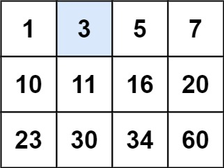
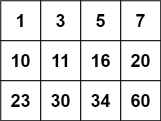
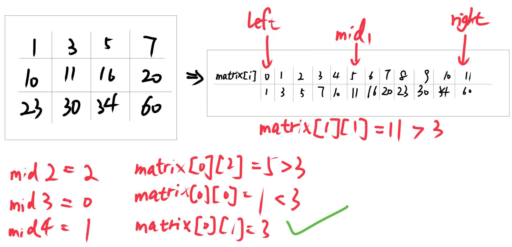

# 0074.搜索二维矩阵

给你一个满足下述两条属性的 m x n 整数矩阵：

每行中的整数从左到右按非严格递增顺序排列。
每行的第一个整数大于前一行的最后一个整数。
给你一个整数 target ，如果 target 在矩阵中，返回 true ；否则，返回 false 。

 

## 示例 1：



输入：`matrix = [[1,3,5,7],[10,11,16,20],[23,30,34,60]], target = 3`
输出：`true`

## 示例 2：



输入：`matrix = [[1,3,5,7],[10,11,16,20],[23,30,34,60]], target = 13`
输出：`false`
 

## 提示：

- $m == matrix.length$
- $n == matrix[i].length$
- $1 <= m, n <= 100$
- $-10^4 <= matrix[i][j], target <= 10^4$

## 思路
以示例1为例：


## 解答
=== "C++"
```cpp
class Solution {
public:
    bool searchMatrix(vector<vector<int>>& matrix, int target) {
        if(matrix.empty()||matrix[0].empty()) return false;

        int m = matrix.size();
        int n = matrix[0].size();
        int left = 0;
        int right = m*n-1;

        while(left <= right){
            int mid = left + (right - left)/2;
            int row = mid / n;
            int col = mid % n;

            if(matrix[row][col]==target) return true;
            else if(matrix[row][col]<target) left = mid+1;
            else right = mid -1;
        }
        return false;
    }
};
```