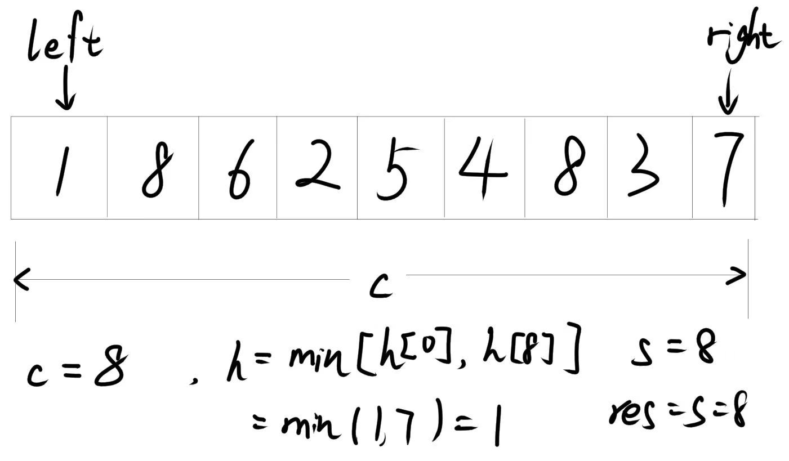
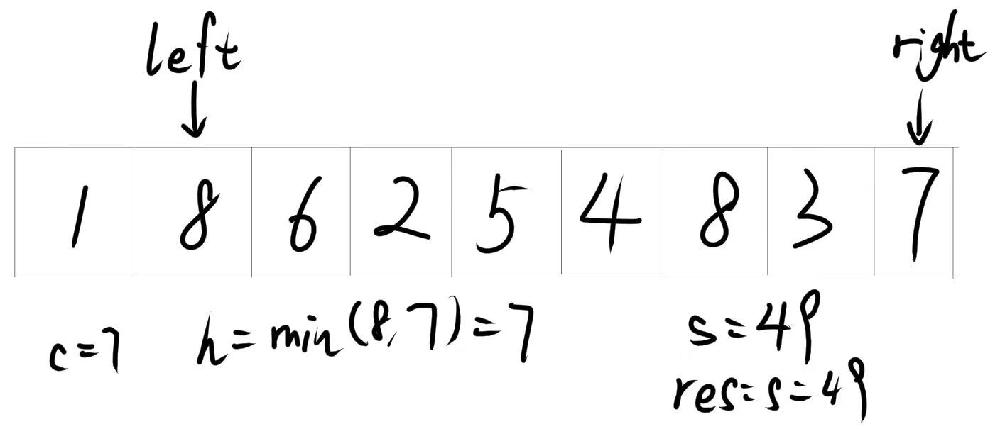

# 盛最多水的容器


给定一个长度为 n 的整数数组 height 。有 n 条垂线，第 i 条线的两个端点是 (i, 0) 和 (i, height[i]) 。

找出其中的两条线，使得它们与 x 轴共同构成的容器可以容纳最多的水。

返回容器可以储存的最大水量。

**说明：你不能倾斜容器。**

## 示例 1：


输入：`[1,8,6,2,5,4,8,3,7]`

输出：`49`

解释：图中垂直线代表输入数组 `[1,8,6,2,5,4,8,3,7]`。在此情况下，容器能够容纳水（表示为蓝色部分）的最大值为 `49`。

## 示例 2：

输入：`height = [1,1]`

输出：`1`

## 提示：

- n == height.length

- 2 <= n <= $10^5$

- 0 <= height[i] <= $10^4$

## 思路

使用双指针法：定义左右指针，分别指向数组的头和尾，计算当前容器的水量，将水量与最大值比较，取较大值。然后将指向较短线的指针向较长线的方向移动一位，重复以上步骤，直到左右指针相遇。






## 解答

=== "C++"
```cpp
class Solution {
public:
    int maxArea(vector<int>& height) {
        int n=height.size();
        int left=0,right=n-1;
        int res=0;
        while(left<right){
            int c=right-left;
            int h=min(height[left],height[right]);
            int s=c*h;
            if(s>res) res=s;
            if(height[left]<=height[right]) left++;
            else right--;
        }
        return res;
    }
};
```