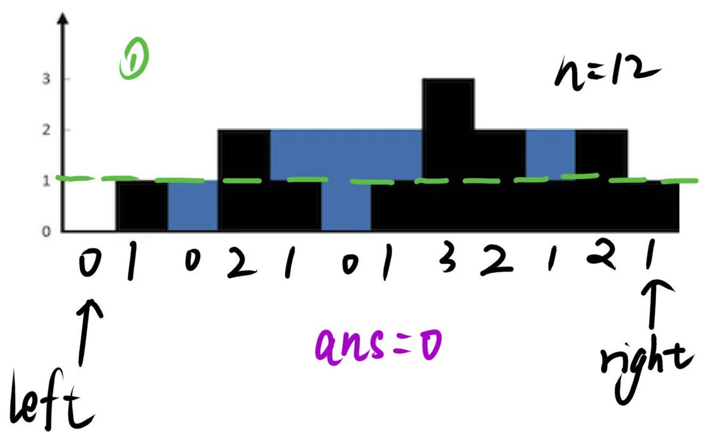
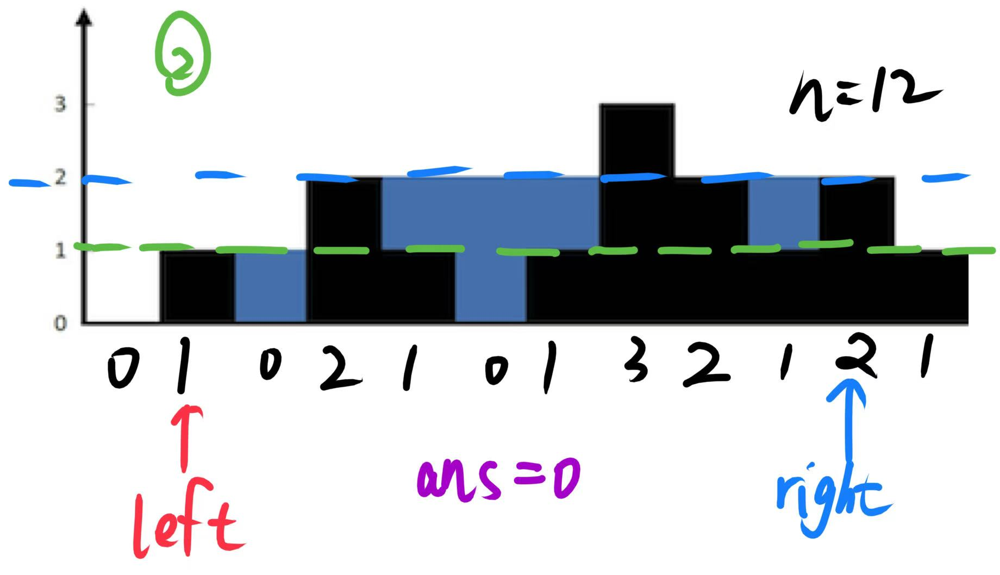

# 0042.接雨水

给定 n 个非负整数表示每个宽度为 1 的柱子的高度图，计算按此排列的柱子，下雨之后能接多少雨水。

## 示例 1：


输入：`height = [0,1,0,2,1,0,1,3,2,1,2,1]`

输出：`6`

解释：上面是由数组 `[0,1,0,2,1,0,1,3,2,1,2,1]` 表示的高度图，在这种情况下，可以接 6 个单位的雨水（蓝色部分表示雨水）。 

## 示例 2：

输入：`height = [4,2,0,3,2,5]`

输出：`9`
 

## 提示：

- n == height.length
- 1 <= n <= 2 * $10^4$
- 0 <= height[i] <= $10^5$

## 思路

## 法一:双指针

维护两个数组：**每个位置能接住的雨水量，等于它左右两侧最大高度的较小值，减去当前柱子的高度**。






## 解答

=== "C++"
```cpp
class Solution {
public:
    int trap(vector<int>& height) {
        int n=height.size();
        vector<int> left(n),right(n);
        left[0]=height[0];
        right[n-1]=height[n-1];

        for(int i=1;i<n;i++){
            left[i]=max(left[i-1],height[i]);
            right[n-i-1]=max(right[n-i],height[n-i-1]);
        }

        int ans=0;
        for(int i=0;i<n;i++){
            ans+=min(left[i],right[i])-height[i];
        }
        return ans;
    }
};
```
## 法二：动态规划

## 法三：单调栈