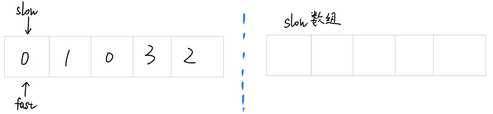
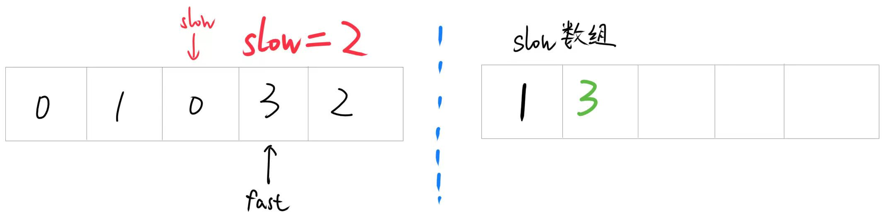
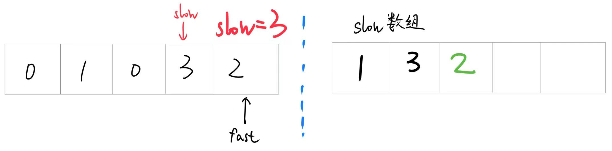

# 0283. 移动零

给定一个数组 nums，编写一个函数将所有 0 移动到数组的末尾，同时保持非零元素的相对顺序。

**请注意** ，必须在不复制数组的情况下原地对数组进行操作。

 

## 示例 1:

输入: `nums = [0,1,0,3,12]`

输出: `[1,3,12,0,0]`

## 示例 2:

输入: `nums = [0]`

输出: `[0]`
 

## 提示:

- 1 <= nums.length <= $10^4$
- $-2^{31}$ <= nums[i] <= $2^{31} - 1$
 

**进阶**：你能尽量减少完成的操作次数吗？

## 思路

使用双指针法，定义快慢指针，快指针遍历数组，当遇到非零元素时，将其赋值给慢指针所指位置，并将慢指针后移一位。遍历结束后，将慢指针之后的位置全部赋值为零。



**注意**：先将非零元素赋值给慢指针所指位置，再移动慢指针。







最后要将慢指针后的位置全部赋值为零。
## 解答

=== "C++"

```cpp
class Solution {
public:
    void moveZeroes(vector<int>& nums) {
        int n=nums.size();
        int slow=0;
        for(int fast=0;fast<n;fast++){
            if(nums[fast]!=0){
                nums[slow]=nums[fast];
                slow++;
            }
        }
        for(int i=slow;i<n;i++){
            nums[i]=0;
        }

    }
};
```