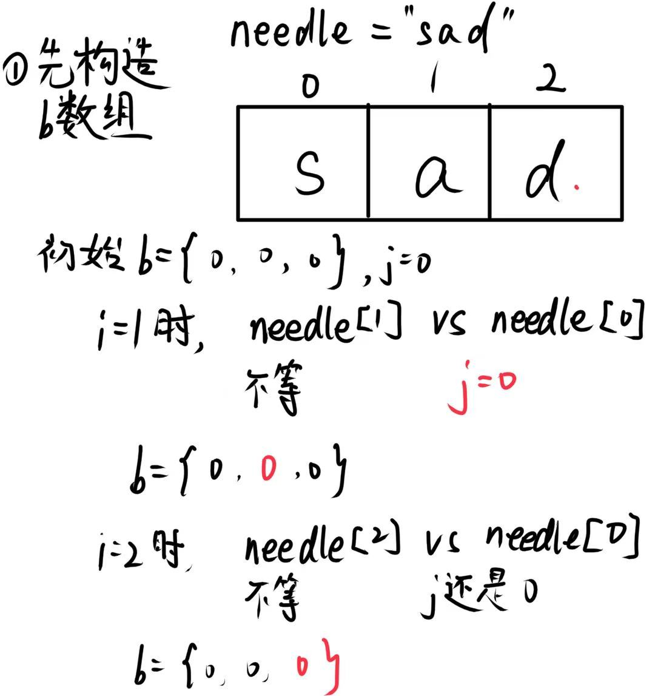
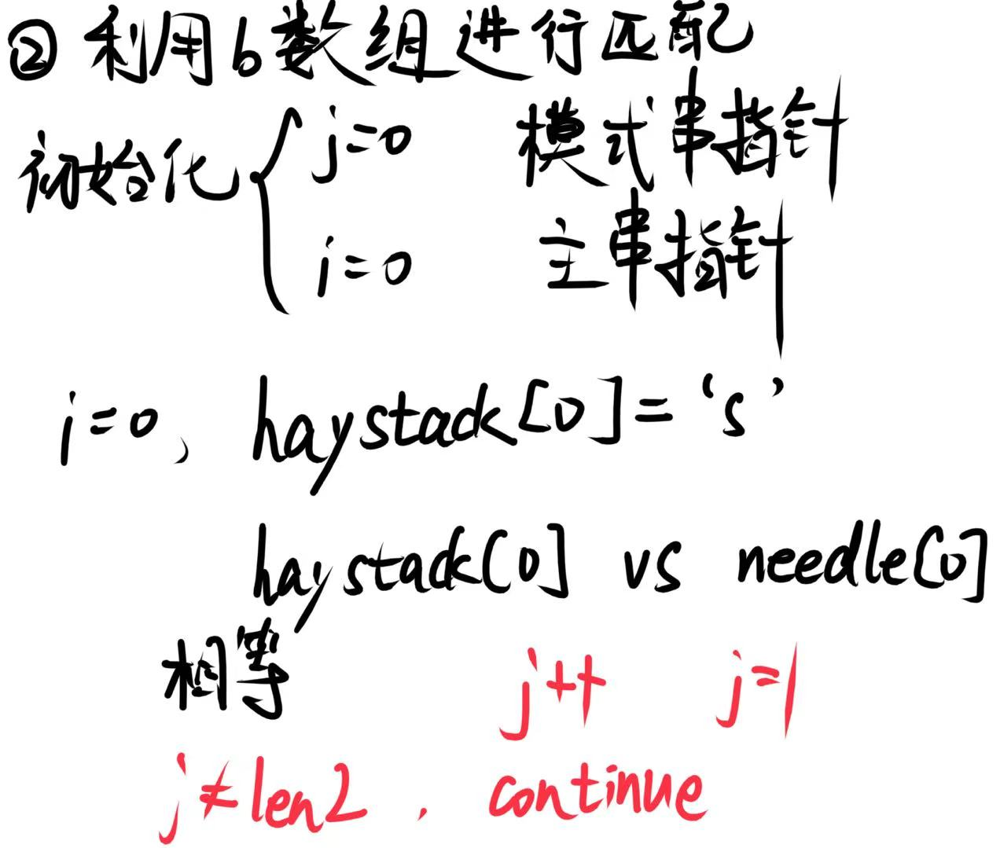
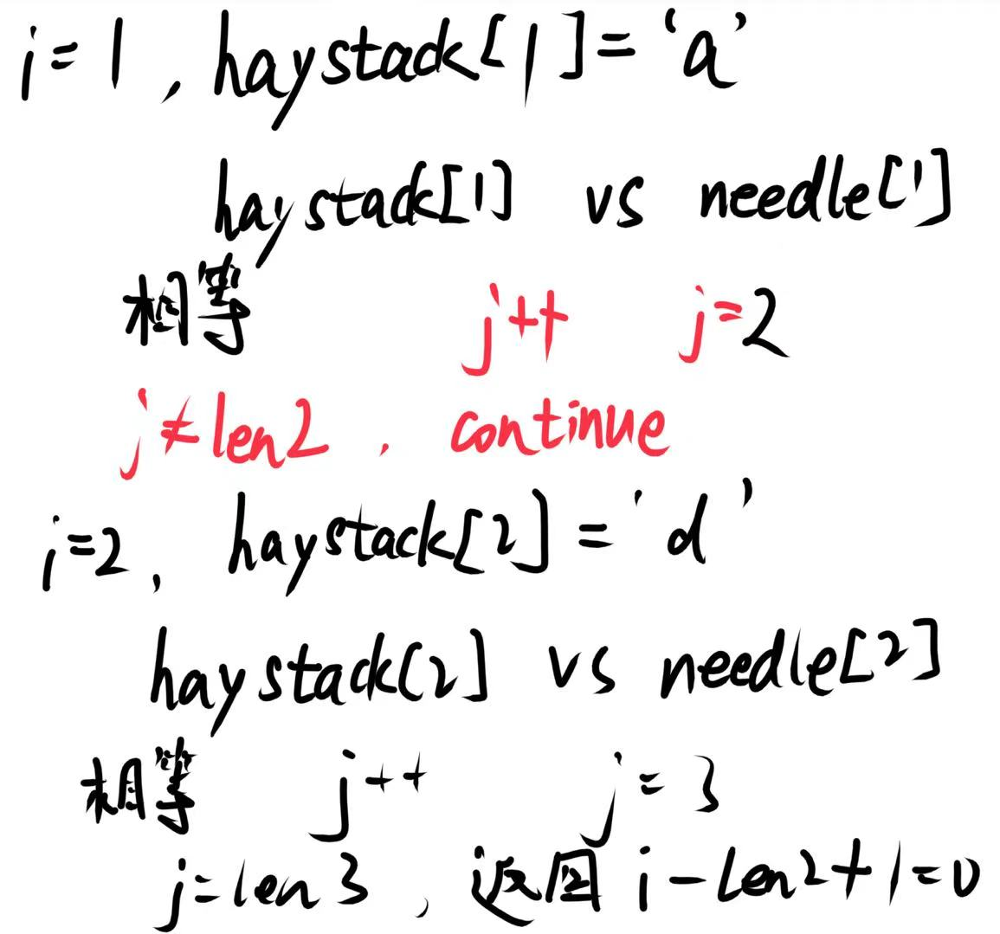

# KMP算法

> KMP（Knuth-Morris-Pratt）算法是一种用于在主字符串中查找子字符串的高效字符串匹配算法。它通过预处理子字符串来构建一个部分匹配表，从而避免在匹配过程中重复比较已经匹配过的字符，提高了匹配效率。

暴力匹配算法在最坏情况下的时间复杂度为O(m*n)，其中m是主字符串的长度，n是子字符串的长度。而KMP算法的时间复杂度为O(m+n)，大大提高了匹配效率，特别适用于需要频繁进行字符串匹配的场景。

## 部分匹配表（Partial Match Table）

> 部分匹配表用于记录子字符串中每个位置的最长前缀和后缀的匹配长度。它帮助我们在匹配失败时，快速找到下一个可能的匹配位置。

### 核心概念

- **前缀**：不包含最后一个字符的子字符串。
- **后缀**：不包含第一个字符的子字符串。
- **最长公共前后缀匹配长度**：对于子字符串的每个位置，记录该位置之前的子字符串的最长前缀和后缀的匹配长度。
- **部分匹配值**：对于子字符串的每个位置，记录该位置之前的子字符串的最长前缀和后缀的匹配长度。

## KMP算法执行步骤

1. **构建部分匹配表**：遍历子字符串，计算每个位置的部分匹配值，存储在一个数组中。
2. **双指针同步匹配**:
      - 使用两个指针，分别指向主字符串和子字符串的当前字符。
      - 如果字符匹配，两个指针同时向后移动。
      - 如果字符不匹配，根据部分匹配表调整子字符串指针的位置，而主字符串指针保持不变。
3. **继续匹配**：重复上述步骤，直到找到匹配的子字符串或主字符串遍历完毕。

> KMP算法的本质是空间换时间，提前计算捷径。

## 例题1 leetcode 28. 找出字符串中第一个匹配项的下标

给你两个字符串 haystack 和 needle ，请你在 haystack 字符串中找出 needle 字符串的第一个匹配项的下标（下标从 0 开始）。如果 needle 不是 haystack 的一部分，则返回  -1 。

### 示例 1：

输入：`haystack = "sadbutsad", needle = "sad"`

输出：`0`

解释："sad" 在下标 0 和 6 处匹配。第一个匹配项的下标是 0 ，所以返回 0 。

### 示例 2：

输入：`haystack = "leetcode", needle = "leeto"`

输出：`-1`

解释："leeto" 没有在 "leetcode" 中出现，所以返回 -1 。
 
### 提示：

- $1 <= haystack.length, needle.length <= 10^4$
- haystack 和 needle 仅由小写英文字符组成

### 最简单方法：内置函数

=== "C++"
```cpp
class Solution {
public:
    int strStr(string haystack, string needle) {
        size_t pos = haystack.find(needle);
        return pos!=string::npos?pos:-1;
    }
};
```

> 当然想通过这道题学一下KMP算法，所以用下面的做法。

### KMP算法实现

首先将模式串和待匹配串的开头对齐，然后比较待匹配串和模式串的第0位是否一致，如果一致则继续匹配下一位，直到不匹配为止。如果不匹配，则根据部分匹配表将模式串向右移动，使它的左border和它原来的右border重合，然后继续比较。代码实现中，可以将模式串的指针设为j，待匹配串的指针设为i，如果适配，则将j的值设为$b_{j-1}$；当匹配完所有的模式串字符，说明找到了一个匹配，根据i的位置推导出匹配到的位置。



> 补充说明：next 数组全为 0，是因为 needle 的所有子串（"s"、"sa"、"sad"）都没有「相等的前后缀」（比如 "sa" 的前缀是 "s"，后缀是 "a"，不相等；"sad" 的前缀 ["s","sa"] 和后缀 ["d","ad"] 也都不相等）。





> **注：此题未涉及回退，建议做一下<u>leetcode459. 重复的子字符串</u>**。

**ACM模式代码实现**

=== "C++"
```cpp
#include<iostream>
#include<string>
#define MAXN 1000010

using namespace std;
int b[MAXN];
int len1,len2;
string s1,s2;
int main(){
	cin>>s1;
	cin>>s2;
	len1 = s1.size(),len2 = s2.size();
	int j = 0;
	for(int i = 1;i<len2;i++){
		while(j>0 && s2[i]!=s2[j]){
			j = b[j-1];
		}
		if(s2[j]==s2[i])  j++;
		b[i] = j;
	}
	
	j = 0;
	for(int i = 0 ;i<len1;i++){
		while(j>0 && s1[i]!=s2[j])  j =b[j-1];
		if(s2[j]==s1[i]) j++;
		if(j == len2){
			cout<<(i+1)-len2 + 1<<endl;
			j = b[j-1];
		}
	}
	
	for(int i=0;i<len2;i++){
		cout<<b[i]<<" ";
	} 
	return 0;
	
}
```

**leetcode模式代码实现**

=== "C++"
```cpp
class Solution {
public:
    int strStr(string haystack, string needle) {
        int len1 = haystack.size();
        int len2 = needle.size();
        if (len2 == 0) return 0;
        vector<int> b(len2,0);
        int j = 0;
        for(int i =1;i<len2;i++){
            while(j>0 && needle[i]!=needle[j]) j=b[j-1];
            if(needle[i]==needle[j])  j++;
            b[i] = j;
        }
        j = 0;
        for(int i =0;i<len1;i++){
            while(j>0 && haystack[i]!=needle[j]) j=b[j-1];
            if(haystack[i]==needle[j])  j++;
            if(j==len2){
                return i - len2 + 1;
            }
        }
        return -1;
    }
};
```

## 例题2：leetcode 459. 重复的子字符串

Coming soon...