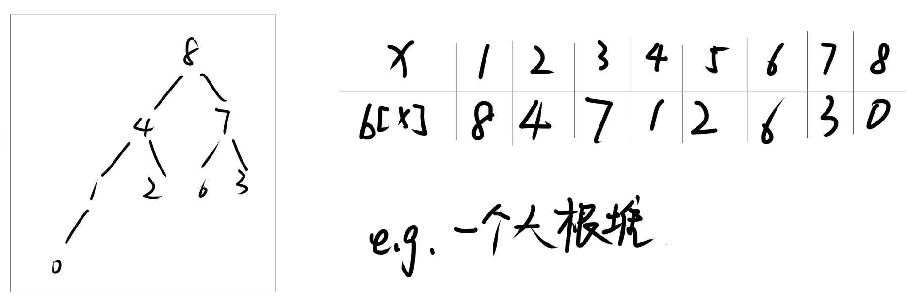

# 二叉堆

## 引入

给定一个数列，初始为空，请支持下面三种操作：

1.  给定一个整数 x，请将 x 加入到数列中。
2. 输出数列中最大的数。
3. 删除数列中最大的数（如果有多个数最大，只删除 1 个）。

一共要操作n（1≤n≤$10^6$）次，插入的整数x满足1≤x<$2^31$。

使用二叉堆（最大堆）可以高效地支持上述操作。

## 数据结构

二叉堆是一种完全二叉树，可以用数组来表示。对于数组中索引为 i 的节点：

- 它的左子节点索引为 2*i + 1
- 它的右子节点索引为 2*i + 2
- 它的父节点索引为 (i - 1) / 2 （向下取整）
二叉堆满足堆性质：每个节点的值都大于或等于其子节点的值。



## 操作实现
1.插入操作（Insert）：


- 将新元素添加到数组的末尾。
- 执行“上浮”操作：将新元素与其父节点比较，如果新元素大于父节点，则交换它们的位置，直到堆性质恢复。

**注意**：如果自己是根或者自己的值比父结点的值小，则停止上浮操作；否则将自己与父结点的值交换，然后对父结点递归执行上浮操作。

用伪代码实现一下：
```c
void modify(int index) {
    int parent = (index - 1) / 2; // 计算父节点索引
    if (index == 0 || heap[index] < heap[parent]) return; // 已经是根节点或者自己的值比父结点的值小，停止上浮
    if (heap[index] > heap[parent]) { // 如果当前节点大于父节点
        swap(heap[index], heap[parent]); // 交换它们的位置
        modify(parent); // 递归对父节点执行上浮操作
    }
}

void push(int index){
    heap[++size] = index; // 将新元素添加到数组的末尾
    modify(size); // 执行上浮操作
}
```
2.获取最大值操作（Get Max）：

- <u>返回数组的第一个元素，即堆顶元素</u>。

用伪代码实现一下：
```c
int getMax() {
    if (!heap.empty()) {
        return heap[0]; // 返回堆顶元素
    }
    throw runtime_error("Heap is empty"); // 如果堆为空，抛出异常
}
```

3.删除最大值操作（Delete Max）：


- 将堆顶元素与数组的最后一个元素交换位置，然后删除最后一个元素。
- 执行“下沉”操作：将新的堆顶元素与其子节点比较，如果它小于任何一个子节点，则将其与较大的子节点交换位置，直到堆性质恢复。

**注意**：如果自己没有子节点，则停止下沉操作；否则找到自己较大的子节点，如果自己的值比较大的子节点的值小，则将自己与该子节点交换，然后对该子节点递归执行下沉操作。

用伪代码实现一下：
```c
void repair(int index){
    if (index >= size) return; // 如果没有子节点，停止下沉操作
    int left = 2 * index + 1; // 左子节点索引
    if(2*index + 2 <= size){
        left = (heap[2*index + 1] > heap[2*index + 2]) ? 2*index + 1 : 2*index + 2; // 找到较大的子节点
    }
    if (heap[index] < heap[left]) { // 如果当前节点小于较大的子节点
        swap(heap[index], heap[left]); // 交换它们的位置
        repair(left); // 递归对较大的子节点执行下沉操作
    }
}

void pop(){
    swap(heap[0], heap[size]); // 将堆顶元素与最后一个元素交换位置
    size--; // 删除最后一个元素
    repair(0); // 执行下沉操作
}
```


## 复杂度分析
- 插入操作的时间复杂度为 O(log n)，其中 n 是堆中的元素数量。
- 获取最大值操作的时间复杂度为 O(1)。
- 删除最大值操作的时间复杂度为 O(log n)。
通过使用二叉堆，我们可以高效地支持插入、获取最大值和删除最大值操作，适用于需要频繁进行这些操作的场景。
## 代码实现
=== "C++"
```cpp
#include <iostream>
#include <vector>
using namespace std;
class MaxHeap {
private:
    vector<int> heap;
    
    void heapifyUp(int index) {
        while (index > 0) {
            int parent = (index - 1) / 2;
            if (heap[index] > heap[parent]) {
                swap(heap[index], heap[parent]);
                index = parent;
            } else {
                break;
            }
        }
    }
    
    void heapifyDown(int index) {
        int size = heap.size();
        while (index < size) {
            int left = 2 * index + 1;
            int right = 2 * index + 2;
            int largest = index;
            
            if (left < size && heap[left] > heap[largest]) {
                largest = left;
            }
            if (right < size && heap[right] > heap[largest]) {
                largest = right;
            }
            if (largest != index) {
                swap(heap[index], heap[largest]);
                index = largest;
            } else {
                break;
            }
        }
    }

public:
    void insert(int x) {
        heap.push_back(x);
        heapifyUp(heap.size() - 1);
    }

    int getMax() {
        if (!heap.empty()) {
            return heap[0];
        }
        throw runtime_error("Heap is empty");
    }

    void deleteMax() {
        if (heap.empty()) {
            throw runtime_error("Heap is empty");
        }
        heap[0] = heap.back();
        heap.pop_back();
        heapifyDown(0);
    }

    bool isEmpty() {
        return heap.empty();
    }

    int size() {
        return heap.size();
    }

};

int main() {
    MaxHeap maxHeap;
    int n;
    cin >> n;
    for (int i = 0; i < n; ++i) {
        int op;
        cin >> op;
        if (op == 1) {
            int x;
            cin >> x;
            maxHeap.insert(x);
        } else if (op == 2) {
            cout << maxHeap.getMax() << endl;
        } else if (op == 3) {
            maxHeap.deleteMax();
        }
    }
    return 0;
}
```

## 快速排序（洛谷P1177）

### 题目描述

将读入的 $N$ 个数从小到大排序后输出。

### 输入格式

第一行为一个正整数 $N$。

第二行包含 $N$ 个空格隔开的正整数 $a_i$，为你需要进行排序的数。

### 输出格式

将给定的 $N$ 个数从小到大输出，数之间空格隔开，行末换行且无空格。

### 输入输出样例 #1

#### 输入 #1

```
5
4 2 4 5 1
```

#### 输出 #1

```
1 2 4 4 5
```

### 说明/提示

对于 $20\%$ 的数据，有 $1 \leq N \leq 10^3$；

对于 $100\%$ 的数据，有 $1 \leq N \leq 10^5$，$1 \le a_i \le 10^9$。

### 思路

我们使用一下**堆排序**的思路来解决这个问题：<u>先把所有元素push进最大堆中，然后不断pop出堆顶元素，最后得到的序列即为排序后的结果</u>。

### 代码实现
=== "C++"
```cpp
#include<cstdio>
#include<algorithm>
using namespace std;
int w[100000+5];
int tot;

int top(){
    return w[1];
}

void modify(int x){
    if(x==1 || w[x]>w[x/2])  return;
    swap(w[x],w[x/2]);
    modify(x/2);
}

void push(int x){
    w[++tot] = x;
    modify(tot);
}

void repair(int x){
    if(x*2 >tot) return;
    int tar = x *2;
    if(x*2+1<=tot){
        tar = w[x*2]<w[x*2+1]?x*2:x*2+1;
    }

    if(w[x]>w[tar]){
        swap(w[x],w[tar]);
        repair(tar);
    }
}

void pop(){
    swap(w[1],w[tot--]);
    repair(1);
}

int main(){

    int n,x;
    scanf("%d",&n);
    for(int i=1;i<=n;i++){
        scanf("%d",&x);
        push(x);
    }

    for(int i=1;i<=n;i++){
        printf("%d ",top());
        pop();
    }
    return 0;
}
```