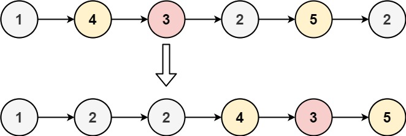

# 0086.分隔链表

给你一个链表的头节点 head 和一个特定值 x ，请你对链表进行分隔，使得所有 小于 x 的节点都出现在 大于或等于 x 的节点之前。

你应当 保留 两个分区中每个节点的初始相对位置。

## 示例 1：



输入：`head = [1,4,3,2,5,2], x = 3`

输出：`[1,2,2,4,3,5]`

## 示例 2：

输入：`head = [2,1], x = 2`

输出：`[1,2]`

## 提示：

- 链表中节点的数目在范围 [0, 200] 内
- -100 <= Node.val <= 100
- -200 <= x <= 200

## 思路

我们可以使用两个虚拟头节点分别创建两个链表：一个链表用于存储所有小于 x 的节点，另一个链表用于存储所有大于或等于 x 的节点。然后，我们遍历原始链表，将每个节点根据其值添加到相应的链表中。最后，我们将两个链表连接起来，并确保新的链表的末尾指向 null。

## 解答

=== "C++"
```cpp
/**
 * Definition for singly-linked list.
 * function ListNode(val, next) {
 *     this.val = (val===undefined ? 0 : val)
 *     this.next = (next===undefined ? null : next)
 * }
 */
/**
 * @param {ListNode} head
 * @param {number} x
 * @return {ListNode}
 */
var partition = function(head, x) {
    let dummy1 = new ListNode(0);
    let dummy2 = new ListNode(0);
    let p1 = dummy1;
    let p2 = dummy2;

    while(head!== null){
        if(head.val<x){
            p1.next = head;
            p1 = p1.next;
        }else{
            p2.next = head;
            p2 = p2.next;
        }
        head = head.next;
    }

    p1.next = dummy2.next;
    p2.next = null;

    return dummy1.next;

};
```