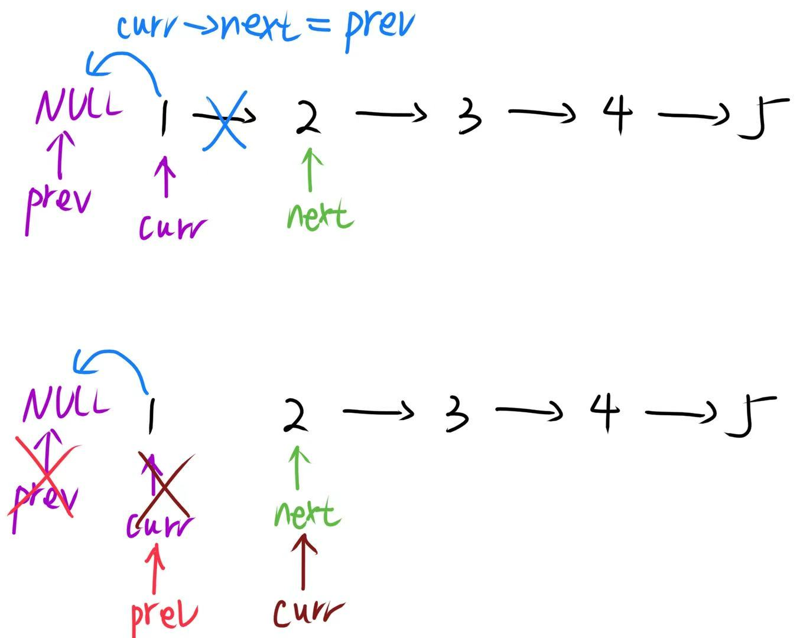
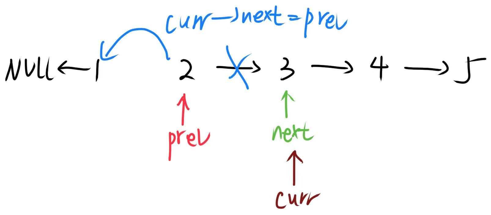

# 0206.反转链表

给你单链表的头节点 head ，请你反转链表，并返回反转后的链表。

## 示例 1：

输入：`head = [1,2,3,4,5]`

输出：`[5,4,3,2,1]`

## 示例 2：

输入：`head = [1,2]`

输出：`[2,1]`

## 示例 3：

输入：`head = []`

输出：`[]`
 
## 提示：

- 链表中节点的数目范围是 [0, 5000]
- -5000 <= Node.val <= 5000
 

## 进阶：链表可以选用迭代或递归方式完成反转。你能否用两种方法解决这道题？

## 思路


采用**迭代法**反转链表：我们通过维护<u> prev（记录当前节点的前一个节点，初始为 NULL）、curr（当前遍历的节点，初始为头节点）和 next（临时保存当前节点的下一个节点）三个指针</u>，在循环中先暂存当前节点的后继，再将当前节点的 next 指针反向指向 prev，然后依次将 prev 和 curr 向后移动一位，直到 curr 遍历到链表末尾，此时 prev 就指向了反转后的新链表头节点，直接返回即可完成整个链表的反转。



此时链表变为 **`NULL←1  2→3→4→5`**



此时链表变为 **`NULL←1←2 3→4→5`**

以此类推，直至完全反转。

## 解答

=== "C++"
    ```cpp
    /**
    * Definition for singly-linked list.
    * struct ListNode {
    *     int val;
    *     ListNode *next;
    *     ListNode() : val(0), next(nullptr) {}
    *     ListNode(int x) : val(x), next(nullptr) {}
    *     ListNode(int x, ListNode *next) : val(x), next(next) {}
    * };
    */
    class Solution {
    public:
        ListNode* reverseList(ListNode* head) {
            ListNode* prev= NULL;
            ListNode* curr= head;
            while(curr!=NULL){
                ListNode* next = curr->next;
                curr->next = prev;
                prev = curr;
                curr = next;
            }
            return prev;
        }
    };
    ```
=== "JavaScript"
    ```JavaScript
    /**
     * Definition for singly-linked list.
     * function ListNode(val, next) {
     *     this.val = (val===undefined ? 0 : val)
     *     this.next = (next===undefined ? null : next)
     * }
     */
    /**
     * @param {ListNode} head
     * @return {ListNode}
     */
    var reverseList = function(head) {
        let prev = null;
        let curr = head;
        while(curr!=null){
            const next = curr.next;
            curr.next = prev;
            prev = curr;
            curr = next;
        }

        return prev;
    };
    ```